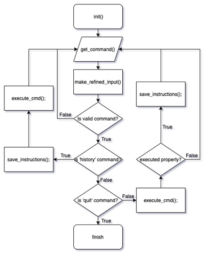
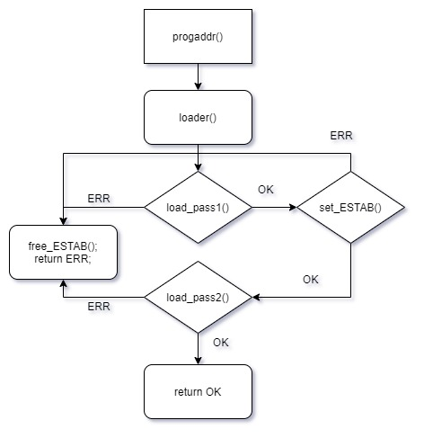

# 1. 프로그램 개요

프로젝트 1, 2에서 구현한 셸에 linking과 loading 기능을 추가하는 프로그램이다. 프로젝트 2에서 구현한 assemble 명령을 통해서 생성된 object 파일을 link 시켜 메모리에 올리는 일을 수행한다. 이를 위해 4가지 기능을 구현하는데 첫째로 주소를 지정하는 명령인 `progaddr`과 linking loader 명령인 `loader`, 프로그램 실행 명령인 `run`, debug 명령인 `bp`이다.


# 2. 프로그램 설명

## 2.1 프로그램 흐름도



<center>그림1> 프로그램 흐름도</center>




<center>그림2> link loader 흐름도</center>


# 3. 모듈 정의

## 3.1 모듈이름 : set_PROGADDR()

### 3.1.1 *기능*

> 사용자로부터 입력 받은 address로 program이 load 될 메모리 시작 주소 위치를 set한다.

### 3.1.2 *사용변수*

> int addr_int - 사용자가 입력한 hex str 주소를 int형으로 변환하여 저장한다.

## 3.2 모듈이름 : loader()

### 3.2.1 *기능*

> pass1과 pass2 알고리즘을 call하여, ES table을 생성(pass1)하고, 이를 이용한 load 작업을 수행(pass2)한다. pass1, pass2 알고리즘을 수행한 뒤에는 register를 모두 0으로 초기화한다. L 레지스터의 값은 프로그램의 길이로 한다는 명세서의 요구사항을 따른다.

### 3.2.2 *사용변수*

> FILE *fp - 입력 받은 object file을 여는데 사용하는 파일 포인터 변수이다.

## 3.3 모듈이름 : load_pass1()

### 3.3.1 *기능*

> object file을 하나하나 열면서, H레코드와 D레코드를 참조하여, ES table을 생성한다. H레코드에는 프로그램의 이름, 프로그램의 시작 주소와 그 길이가 적혀있다. H레코드를 만나면, 프로그램의 이름과 해당 location을 ES table에 push한다. 이 때, 이 전에 open한 object file의 다음 메모리 주소부터 올라갈 수 있도록, 이전 프로그램의 길이 만큼 더하여, CS_ADDR를 조정한다. 다음 D레코드를 만나게 되면, symbol들을 ES table에 push한다. CS_ADDR을 더하여 메모리에 실제 올라가게 될 address를 저장하여야 한다. 이렇게 CS name 혹은 symbol name과 해당 주소가 mapping된 ES table이 완성되게 되고, 이는 load_pass2() 알고리즘에서 활용된다.

### 3.3.2 *사용변수*

> char *ptr - object file로부터 line을 입력받게 되면, 이를 앞에서부터 탐색하면서, name 혹은 object code에 접근해야 한다. 문자열 line의 각 character를 탐색하는 char 포인터 변수이다.
>
> char line[LINE_LEN] - object file로부터 읽어들인 하나의 line을 저장하는 문자열 자료구조이다.
>
> char CS_name[SYMBOL_LEN], char CS_start_addr_hexstr[STR_ADDR_LEN], char CS_len_hexstr[STR_ADDR_LEN], int CS_start_addr_int;int CS_len_hexstr_int - H레코드를 만나게 되었을 때, line을 탐색하면서, control section의 이름, 시작주소, 길이를 1차적으로 char 문자열로 얻어오고, 이 정보를 int 형으로 바꿔서 저장한다. 이를 위한 변수들이다.
>
> char SYM_name[SYMBOL_LEN], char sym_addr_hexstr[STR_ADDR_LEN], int sym_addr_int - D레코드를 만나게 되었을 때, line을 탐색하면서, symbol의 이름, 저장될 메모리 주소(cs 시작 address에 상대적인)를 1차적으로 char 문자열로 얻어오고, 이 정보를 int 형으로 바꿔서 저장한다. 이를 위한 변수들이다.

## 3.4 모듈이름 : load_pass2()

### 3.4.1 *기능*

> pass1에서 완성한 ES table과 R, T, M 레코드를 참조하여 memory에 object 코드들을 적재한다.
>
> - H 레코드를 만났을 때
>
>   control section의 이름을 RFTAB[1]에 저장한다.
>
> - R 레코드를 만났을 때
>
>   R레코드에 reference number와 symbol name이 있다. RFTAB[reference number]에 symbol의 address를 저장해야 하는데, 이는 pass1 알고리즘에서 생성한 ES table을 탐색하여 찾는다.
>
> - T 레코드를 만났을 때
>
>   object code들을 메모리에 적재한다. T 레코드에 object code가 올라갈 MEM의 시작 주소(cs address에 상대적인)가 적혀있고, T 레코드의 1byte 씩 접근하여 메모리에 적재한다.
>
> - M 레코드를 만났을 때
>
>   M레코드에 modify를 적용하는 주소와 길이가 적혀있다. 해당 메모리 주소에 이미 machine code가 적재되어 있는데, 이를 다시 가져와서 M레코드가 지령하는 만큼의 조정을 가한 후, 다시 수정된 value를 메모리에 저장한다. 예를 들어, +02라고 되어있다면, RFTAB[2]에서 value를 얻어온 뒤 그 값만큼의 조정을 하는 것이다.  

### 3.4.2 *사용변수*

> char *ptr - object file로부터 line을 입력받게 되면, 이를 앞에서부터 탐색하면서, name 혹은 object code에 접근해야 한다. 문자열 line의 각 character를 탐색하는 char 포인터 변수이다.
>
> char line[LINE_LEN] - object file로부터 읽어들인 하나의 line을 저장하는 문자열 자료구조이다.
>
> int RFTAB[MAX_RF_NUM] - reference number가 index 역할을 하고, symbol의 address가 value로서 저장되어있는 int 배열이다. 결국 reference number와 address value를 mapping하고 있는 table로서 기능한다.
>
> char rf_ind_hexstr[NAME_LEN], int rf_ind - object file에서 읽어들인 reference number를 1차적으로 문자열에 저장했다가, 다시 이를 int형으로 바꿔 저장한다.
>
> char ES_name[NAME_LEN] - R 레코드에서 읽어들인 ES_name을 저장하는 문자열
>
> char one_line_T_record_len_hexstr[STR_ADDR_LEN], int one_line_T_record_len_int - T 레코드 한 line의 길이를 문자열로 읽어와서 이를 int값으로 바꿔 저장한다.
>
> char starting_addr_hexstr[STR_ADDR_LEN] - object code가 올라갈 메모리의 시작주도를 저장하는 문자열 변수이다.
>
> char byte_hexstr[STR_ADDR_LEN], int byte_int - T레코드에 적인 object code들에 대하여 1byte씩 접근하여 이를 메모리에 적재한다. 그 1 byte 값을 우선 문자열 형태로 저장한 뒤 이름 int 형으로 바꾸어 저장한다.
>
> int LOC_to_push - 1 byte를 적재할 메모리의 주소를 관리하는 변수이다.
>
> char LOC_to_be_modified_hexstr[STR_ADDR_LEN], int LOC_to_be_modified_int - modify를 해야하는 location의 주소 값을 나타내는 변수. 먼저 문자열로 해당 정보를 받았다가 이를 int 형 자료로 바꿔 저장한다.
>
> char halfbytes_len_to_be_modified_hexstr[STR_ADDR_LEN], int halfbytes_len_to_be_modified_int - 수정될 half byte의 길이를 나타내는 변수이다. halfbytes_len_to_be_modified_int d의 값은 5 또는 6이다.
>
> char half_bytes_to_be_modified_str[STR_ADDR_LEN] - 메모리가 가지고 있는 값 중에서 수정되어야할 값을 메모리에서 가져와서 문자열 형태로 저장한다.
>
> char LOC_to_be_modified_hexstr[STR_ADDR_LEN], int LOC_to_be_modified_int - M레코드는 수정해야할 메모리 주소를 알려주게 되는데 이를 1차적으로 문자열에 저장하였다가, 후에 int형 자료로 변환하여 저장한다.
>
> int dx - modify를 적용하는 증분(음수일 수 있음)이다. 다름 아닌 RFTAB[rf_ind_int]인데, 변화량이라는 어감이 느껴지도록 readability를 위해 dx라는 변수명을 사용하였다. target object code에 dx만큼의 조정을 가하게 된다.

## 3.5 모듈이름 : push_to_ESTAB()

### 3.5.1 *기능*

> ES table에 es node를 push하는 작업을 수행한다. ES table은 hash size 20인 hash map으로 구현되어있으며, name과 address의 묶음을 하나의 정보단위로 가지고 있다. 2주차 project의 symbol table과 같은 형태로 구현되어있기 때문에, push 로직도 동일하다. hash function을 이용하여 index를 얻은뒤 이 index에 저장되어있는 linked list에 해당 es node를 삽입하면 된다.

### 3.5.2 *사용변수*

> int ind - hash function을 이용하여 es node가 저장될 index를 구한다. 이를 저장하는 int형 변수이다.

## 3.6 모듈이름 : find_ESNODE_or_NULL()

### 3.6.1 *기능*

> es name을 입력받아 ES table을 탐색하여 이에 해당하는 node를 돌려준다. 해당 es name이 없다면, NULL 값을 return한다.

### 3.6.2 *사용변수*

> int ind - hash function을 이용하여 es node가 저장된 index를 구한다. 이를 저장하는 int형 변수이다.

## 3.7 모듈이름 : free_ESTAB()

### 3.7.1 *기능*

> ESTAB에 할당된 메모리를 해제하는 함수이다.

### 3.7.2 *사용변수*

> ES_NODE *cur_node, *pre_node - cur_node는 link를 타고 할당을 해제할 노드를 방문하기 위한 사용자정의 데이터타입 포인터 변수이고, pre_node에 assign된 메모리를 해제한다. 

## 3.8 모듈이름 : bp_command()

### 3.8.1 *기능*

> 목적 : bp 관련한 사용자의 명령에 따라 관련 작업을 수행하고, 그 내용은 아래와 같다.
>   1. bp : bp가 걸린 메모리 주소를 보여준다.
>   2. bp clear : set 되어 있는 bp값들을 모두 해제한다.
>     3. bp [address] : 해당 address에 bp를 설정한다.
>
> break point는 MEMORY[] 배열과 동일한 크기의 배열(전역변수 BP_CHK[])을 생성하고, BP_CHK[해당address] = true 로 표시함으로써 break point를 표시한다. 보다 자세한 설명은 아래 전역변수 BP_CHK와 BP_ADDR를 설명하는 란에서 한다.

### 3.8.2 *사용변수*

> 없음

## 3.9 모듈이름 : run()

### 3.9.1 *기능*

> machine instruction을 수행시키며, break이 걸린 point들을 잡아내어 그 때마다 register의 내용을 print한다.

### 3.9.2 *사용변수*

> END - PROGRAM_ADDR에 CS_LEN을 더한 값을 저장하며, 프로그램을 위해 할당된 메모리공간 주소의 마지막을 지정한다.

## 3.10 모듈이름 : execute_instruction()

### 3.10.1 *기능*

> 메모리에 적재된 object code들을 메모리에서 읽어들여 machine instruction을 수행시킨다. 구체적인 logic은 다음과 같다.
>
> 1. 메모리에서 1byte를 읽어온다
> 2. & 0b00000011을 수행하여 8bit 중 뒤의 2bit에 자리한 n, i 값을 얻는다.
> 3. 메모리에서 읽어온 값에서 ni값을 빼면 opcode가 무엇인지 알게된다.
> 4. opcode를 이용하여, op node를 얻는다.
> 5. op node에 기록된 format을 살필 수 있게 되고, 이로써 메모리에서 몇 byte를 가져와야하는지 알 수 있게 된다.
> 6. format에 맞도록 메모리에서 데이터를 가져와서 operand를 설정한다.
>    1. format이 3이고 operand가 2의 보수표현 음수인 경우, hex str으로 표현된 메모리의 값을 그대로 decimal int로 변환하게 되면 기본적으로 양수로 변환되므로 이를 보정해야한다.
>    2. format이 3 또는 4라면, b, p, x의 값을 추가적으로 확인하여, disp를 한번 더 조정한다.
> 7. operation을 크게 LD 관련 명령어, ST 관련 명령어, J 관련 명령어가 있다고 분류하고, 각각 해당하는 subroutine을 불러 해당 operation을 수행한다.
>
> project 3에서 I/O 관련 3가지 명령을 다음과 같이 처리한다.
>
> - RD 명령 : RD는 항상 input device로부터 아무것도 받지 못한다는 가정을하고, NULL 값(ascii == 0)을 가져오는 방식으로 동작하도록 설정한다
> - TD 명령 : CC(Condition Code)를 '<'로 set하고, 바로 다음 instuction으로 넘어간다고 가정한다. 
> - WD 명령 : 바로 다음 instruction으로 넘어간다고 가정한다.

### 3.10.2 *사용변수*

> int opcode - opcode의 값을 담는 변수이다.
>
> int format - op 명령의 format을 저장하는 변수이다.
>
> int reg1, reg2 - 레지스터 번호를 저장하는 변수이다.
>
> int disp - 3형식 insturcion의 하위 1.5 byte에 적힌 disp이다. int형으로 저장한다.
>
> int ni, x, b, p, e - 각각 n, i, x, b, p, e bit를 나타낸다. 해당 변수들의 정보를 바탕으로 addressing 방법을 결정하게 된다.
>
> int TA - disp에서 relative를 반영한 실질적 Target Address를 구해 저장한다.
>
> int start_loc - 프로그램 수행의 첫 location 주솟값을 저장한다.
>
> int operand - machine insctruction의 operand에 해당하는 메모리 값을 저장하는 변수이다.

## 3.11 모듈이름 : LD_related_instruction()

### 3.11.1 *기능*

> operand로 (m..m+2)가 오는 즉, operand로 'MEM가 가지고 있는 value'가 오는 경우의 instruction을 처리한다. n과 i의 값을 읽어서 ni == 00 인 경우는 COPY 프로그램에 존재하지 않는다는 가정을 하고, ni == 01인 경우 ni == 10인 경우 ni == 11인 경우로 나누어 해당되는 방식으로 addressing을 수행하여 Val 값을 정한다.
>
> - ni == 01인 경우(immediate addressing)
>
>   Val은 인자로 들어온 TA 자체가 된다.
>
> - ni == 10인 경우(indirect addressing)
>
>   TA를 MEMORY[TA]로 갱신하고, 해당 메모리 주소로 접근하여 메모리가 가지고 있는 값을 Val 값으로 정한다.
>
> - ni == 11인 경우(simple addressing)
>
>   TA 메모리 주소로 접근하여 메모리가 가지고 있는 값을 Val 값으로 정한다.

### 3.11.2 *사용변수*

> int Val - 해당 address로 접근하여 MEMORY[TA]의 값을 가져오게 되는데 이를 저장하는 변수이다. 


## 3.12 모듈이름 : J_related_instruction()

### 3.12.1 *기능*

> operand로 m 가 오는 즉, operand로 MEM의 주소가 오는 경우의 mnemonic을 처리한다. LD 관련 명령과 마찬가지로 n과 i의 값을 읽는다. ni == 00과 ni==01인 경우는 COPY 프로그램에 존재하지 않는다는 가정을 하고, ni == 10인 경우와 ni == 11인 경우로 나누어 해당되는 방식으로 addressing을 수행하여 Addr 값을 정한다.
>
> - ni == 10인 경우(indirect addressing)
>
>   MEMORY[TA]의 값을 Addr에 저장한다.
>
> - ni == 11인 경우(simple addressing)
>
>   Addr이 TA가 된다.

### 3.12.2 *사용변수*

> int Addr - TA를 저장하는 변수이다. ni == 10인 경우 TA를 MEMORY[TA]로 조정한다.


## 3.13 모듈이름 : ST_related_instruction()

### 3.13.1 *기능*

> operand로 m..m+2가 오며, 해당 메모리 주소에 val_to_push를 적재한다. 적재하려는 데이터가 몇 byte인지를 인자로 받아 해당하는 만큼 메모리에 적재한다. 이를테면, STCH는 1byte만을 적재하는 명령어이고, STA는 3byte를 STF는 6byte를 적재하는 명령이다.

### 3.13.2 *사용변수*

> 없음

## 3.14 모듈이름 : twos_complement_str_to_decint()

### 3.14.1 *기능*

> modify해야할 대상이 되는 byte code가 2의 보수표현 음수인 경우가 있는데, 이를 그대로 int로 변환하게 되면 양수 값이되어 보정하는 작업이 필요하다. 문자열 hexstr을 signed 32bit hexstr로 간주하고, 조응하는 dec int값으로 변환한다. hex str 값이 2의 보수표현 음수라면, 해당 값에 " | 0xFF000000" 연산을하여, 앞에 FF를 붙여 음수 sign bit가 반영된 32bit의 수로 변환한다. 

### 3.14.2 *사용변수*

> int res - return할 결과를 저장하는 변수이다.

## 3.15 모듈이름 : get_opcode_or_NULL_by_opcode()

### 3.15.1 *기능*

> project 2에서 구현하였던 get_opcode() 함수는 인자로 menmonic을 주었을 때, 해당하는 op node를 얻을 수 있는 함수였다. 하지만, project 3 run을 수행할 때는 opcode를 이용하여 op node를 찾아야한다. 해당 함수는 opcode를 입력 받아 해당 opcode에 맞는 OP_node를 return 하는 작업을 수행한다.

### 3.15.2 *사용변수*

> int ind - hash function으로 특정 opcode가 저장된 index에 접근한다. 이 index를 저장하는 변수이다.

# 4. 전역 변수 정의

## 4.1 int ES_NODE *ESTAB[ESTAB_HASH_SIZE]

> ES NODE는 char name[SYMBOL_LEN], int addr, struct ES_NODE* nxt 데이터를 가지고 있는 사용자 정의 데이터 타입 구조체이다. 이를 가리키는 포인터변수로 이루어진 hash table을 정의하였다. ESTAB_HASH_SIZE는 20이다.

## 4.2 int BP_CHK[MEM_SIZE]

> break point가 걸려있는 address를 저장하기 위한 방법으로 위의 자료구조를 정의하였다. BP_CHK는 메모리의 개수와 동일한 크기를 가지고 있는 배열로 break point가 걸려있는 지점을 true로 바꿈으로써 위치를 표시한다.

## 4.3 int BP_ADDR[MEM_SIZE]

> 4.2와 같이 자료구조를 정의하게 되면 bp 지점들을 조회할 때마다, 메모리 전체를 탐색하게 된다. 효율성을 위해서 BP_CHK[address] 값이 true인 address를 저장하는 1차원 배열을 정의하였다. 만약, bp가 걸린 지점들을 조회하는 명령을 수행할 때, BP_CHK[BP_ADDR[i]]의 값을 가져오면 된다.

## 4.4 int PRINT_FLAG

> 메모리에 적재된 instruction들을 수행할 때, bp를 만나게되면, run() 수행을 멈추면서, 그 지점의 register 값들을 화면에 출력하여 보여주게 된다. 이 다음 다시 run()을 수행할 때는 해당 지점에서 register 값들을 화면에 보여줄 필요가 없으므로, 이를 조정하는 flag를 전역변수로 정의하였다.

## 4.5 int NUM_OF_BP

> bp의 개수를 저장하는 전역변수이다.

## 4.6 int REG[REG_NUM + 1]

> register의 값을 가지고 있는 1차원 배열 자료구조이다. 0번 레지스터(A)에 17이 저장되어있다면, REG[0] == 17로 저장하는 방식이다. 

## 4.7 char CC;

> Condition Code를 저장하는 전역변수이다. '<', '>', '=' 3가지 값 중 하나의 값을 가지게 된다.

## 4.8 int PROGRAM_ADDR

> 프로그램의 시작 주소를 저장하는 전역 변수이다.

## 4.9 int CS_ADDR

> Control Section의 시작 주소를 저장하는 전역 변수이다.

## 4.10 int CS_LEN

> Control Section의 길이를 저장하는 전역 변수이다.

## 4.11 int PROGRAM_LEN

> 프로그램의 길이를 저장하는 전역 변수이다.

## 4.12 int FIRST_INSTRUCTION_ADDR

> 프로그램에서 첫번째 instruction이 수행되는 주소를 저장하는 변수이다.

# 5. 코드

## 5.1 20121277.h

```c
//
// Created by 김주호 on 2021/03/10.
//

#ifndef SP_PROJ1_20121277_H
#define SP_PROJ1_20121277_H

/* 포함되는 파일 */
#include <stdio.h>
#include <string.h>
#include <stdlib.h>

#include "utils.h"
#include "shell_commands.h"
#include "memory_commands.h"
#include "opcode_table_commands.h"
#include "assembler_commands.h"
#include "loader_commands.h"

/* 정의되는 상수 */
#define MAX_INPUT_LEN 100
#define MAXNUM_OF_TOKEN 5
#define MAX_TOKEN_LEN 15

typedef enum SUCCESS_or_FAIL {
    FAIL = 0,
    SUCCESS
}SUCCESS_or_FAIL;

/* 전역 변수 */
char INPUT[MAX_INPUT_LEN];
char INPUT_SPLIT[MAXNUM_OF_TOKEN][MAX_TOKEN_LEN];
char REFINED_INPUT[MAX_INPUT_LEN];
int NUM_OF_TOKENS;

/* 사용자 정의 data type */
typedef enum COMMAND {
    // 0 ~ 4 : shell commands
    HELP_CMD = 0,
    DIR_CMD,
    QUIT_CMD,
    HISTORY_CMD,
    TYPE_CMD,

    // 5 ~ 8 : memory commands
    DUMP_CMD,
    EDIT_CMD,
    FILL_CMD,
    RESET_CMD,

    // 9, 10 : opcode table commands
    OPCODE_MNEMONIC_CMD,
    OPCODELIST_CMD,

    // 11, 12 : assemble commands
    ASSEMBLE_CMD,
    SYMBOL_CMD,

    // 13, 14, 15, 16 : loader commands
    PROGADDR_CMD,
    LOADER_CMD,
    BP_CMD,
    RUN_CMD,

    // 17 : INPUT error
    WRONG_CMD
} COMMAND;

/* 함수 원형 */
void init();
void refresh_input();
SUCCESS_or_FAIL input_split_by_comma();
COMMAND get_command();
SUCCESS_or_FAIL execute_cmd(COMMAND cmd);
void make_refined_input();

#endif //SP_PROJ1_20121277_H
```


## 5.2 20121277.c

```c
#include "20121277.h"

/* 프로그램 시작 */
int main() {
    COMMAND cmd;
    init();
    while (1) {
        printf("sicsim> ");

        refresh_input();
        scanf("%[^\n]", INPUT);
        getchar();

        // 1. 긴 명령어를 입력하거나 2. token의 개수가 5개 이상이면 error 처리
        if (!input_split_by_comma()) {
            printf("COMMAND err!\n");
            continue;
        }
        // 3. 예약되어있지 않은 명령어를 입력하거
        cmd = get_command();
        if (cmd == WRONG_CMD) {
            printf("err : wrong cmd or wrong number of parameters!\n");
            continue;
        } else if (cmd == HISTORY_CMD) {
            make_refined_input();
            save_instructions(REFINED_INPUT);
            execute_cmd(cmd);
            continue;
        } else if (cmd == QUIT_CMD) {
            free_log_of_instructions();
            free_OPTAB();
            free_ESTAB();
            break;
        }

        if (execute_cmd(cmd) == FAIL) continue;

        // store instructions
        make_refined_input();
        save_instructions(REFINED_INPUT);
    }
    return 0;
}

/*------------------------------------------------------------------------------------*/
/*함수 : init*/
/*목적 : 명령어들의 history를 저장하기 위한 linked list를 초기화하며, memory의 마지막 주소를 초기화한다.*/
/*리턴값 : 없음*/
/*------------------------------------------------------------------------------------*/
void init() {
    HEAD = NULL;
    TAIL = NULL;
    NUM_OF_TOKENS = 0;
    LAST_ADDR = -1;
    init_OPTAB("opcode.txt");
    for (int i = 0; i < MEM_SIZE; i++){
        BP_CHK[i] = 0;
    }
}

/*------------------------------------------------------------------------------------*/
/*함수 : refresh_input*/
/*목적 : 사용자로부터 다시 입력을 받을 수 있는 상태가 되도록, INPUT char 배열, INPUT_SPLIT[][] char 배열을 초기화*/
/*리턴값 : 없음*/
/*------------------------------------------------------------------------------------*/
void refresh_input() {
    INPUT[0] = '\0';
    for (int i = 0; i < MAXNUM_OF_TOKEN; i++) {
        strcpy(INPUT_SPLIT[i], "\0");
    }
    NUM_OF_TOKENS = 0;
}

/*------------------------------------------------------------------------------------*/
/*함수 : input_split_by_comma*/
/*목적 : 사용자로부터 입력 받은 명령어들을 ‘,’ 기호를 기준하여, parsing*/
/*리턴값 : SUCCESS - 성공인 경우, FAIL - 실패인 경*/
/*------------------------------------------------------------------------------------*/
SUCCESS_or_FAIL input_split_by_comma() {
    int cur_ind, dx;

    for (cur_ind = 0; INPUT[cur_ind] == ' ' || INPUT[cur_ind] == '\t'; cur_ind++);
    while (cur_ind < MAX_INPUT_LEN) {
        dx = get_dx_to_nxt_token(INPUT + cur_ind);

        if (dx == -1) break;
        if (NUM_OF_TOKENS >= MAXNUM_OF_TOKEN - 1) return FAIL;
        if (strlen(INPUT + cur_ind) > MAX_TOKEN_LEN) return FAIL;

        if (IS_COMMA == YES_COMMA) {
            if (strcmp(INPUT + cur_ind, "") == 0) {
                strcat(INPUT_SPLIT[--NUM_OF_TOKENS], ",");
                NUM_OF_TOKENS++;
            }
            else {
                strcpy(INPUT_SPLIT[NUM_OF_TOKENS], INPUT + cur_ind);
                strcat(INPUT_SPLIT[NUM_OF_TOKENS++], ",");
            }
        }
        else {
            strcpy(INPUT_SPLIT[NUM_OF_TOKENS++], INPUT + cur_ind);
        }
        cur_ind += dx;
    }
    return SUCCESS;
}

/*------------------------------------------------------------------------------------*/
/*함수 : get_command*/
/*목적 : 사용자로부터 command를 입력받는다.*/
/*리턴값 : *_command - 성공인 경우 해당 COMMAND, wrong_command - 잘못된 명령어인 경우*/
/*------------------------------------------------------------------------------------*/
COMMAND get_command() {
    char *cmd = INPUT_SPLIT[0];
    // shell commands
    if ((strcmp(cmd, "h") == 0 || strcmp(cmd, "help") == 0) && NUM_OF_TOKENS == 1) return HELP_CMD;
    else if ((strcmp(cmd, "q") == 0 || strcmp(cmd, "quit") == 0) && NUM_OF_TOKENS == 1) return QUIT_CMD;
    else if ((strcmp(cmd, "d") == 0 || strcmp(cmd, "dir") == 0) && NUM_OF_TOKENS == 1) return DIR_CMD;
    else if ((strcmp(cmd, "hi") == 0 || strcmp(cmd, "history") == 0) && NUM_OF_TOKENS == 1) return HISTORY_CMD;
    else if (strcmp(cmd, "type") == 0 && NUM_OF_TOKENS == 2) return TYPE_CMD;

        // memory commands
    else if ((strcmp(cmd, "du") == 0 || strcmp(cmd, "dump") == 0) && (NUM_OF_TOKENS >= 1 && NUM_OF_TOKENS <= 3))
        return DUMP_CMD;
    else if ((strcmp(cmd, "e") == 0 || strcmp(cmd, "edit") == 0) && NUM_OF_TOKENS == 3) return EDIT_CMD;
    else if ((strcmp(cmd, "f") == 0 || strcmp(cmd, "fill") == 0) && NUM_OF_TOKENS == 4) return FILL_CMD;

        // opcode table commands
    else if (strcmp(cmd, "reset") == 0 && NUM_OF_TOKENS == 1) return RESET_CMD;
    else if (strcmp(cmd, "opcode") == 0 && NUM_OF_TOKENS == 2) return OPCODE_MNEMONIC_CMD;
    else if (strcmp(cmd, "opcodelist") == 0 && NUM_OF_TOKENS == 1) return OPCODELIST_CMD;

        // assembler commands
    else if (strcmp(cmd, "assemble") == 0 && NUM_OF_TOKENS == 2) return ASSEMBLE_CMD;
    else if (strcmp(cmd, "symbol") == 0 && NUM_OF_TOKENS == 1) return SYMBOL_CMD;

        // loader commands
    else if (strcmp(cmd, "progaddr") == 0 && NUM_OF_TOKENS == 2) return PROGADDR_CMD;
    else if (strcmp(cmd, "loader") == 0 && NUM_OF_TOKENS <= 4) return LOADER_CMD;
    else if (strcmp(cmd, "bp") == 0 && (NUM_OF_TOKENS >= 1 && NUM_OF_TOKENS <= 2)) return BP_CMD;
    else if (strcmp(cmd, "run") == 0 && NUM_OF_TOKENS == 1) return RUN_CMD;
    return WRONG_CMD;
}

/*------------------------------------------------------------------------------------*/
/*함수 : execute_cmd*/
/*목적 : 사용자로부터 입력받은 command를 수행한다.*/
/*리턴값 : SUCCESS - 성공인 경우, FAIL - 실패인 경우*/
/*------------------------------------------------------------------------------------*/
SUCCESS_or_FAIL execute_cmd(COMMAND cmd) {
    SUCCESS_or_FAIL RESULT = SUCCESS;
    OK_or_ERR state = OK;
    switch (cmd) {
        // shell commands
        case HELP_CMD:
            help();
            break;
        case QUIT_CMD:
            break;
        case DIR_CMD:
            dir();
            break;
        case HISTORY_CMD:
            history();
            break;
        case TYPE_CMD:
            type(INPUT_SPLIT[1]);
            break;

        // memory commands
        case DUMP_CMD:
            RESULT = dump(NUM_OF_TOKENS, INPUT_SPLIT[1], INPUT_SPLIT[2]);
            break;
        case EDIT_CMD:
            RESULT = edit(INPUT_SPLIT[1], INPUT_SPLIT[2]);
            break;
        case FILL_CMD:
            RESULT = fill(INPUT_SPLIT[1], INPUT_SPLIT[2], INPUT_SPLIT[3]);
            break;
        case RESET_CMD:
            reset();
            break;

        // opcode table commands
        case OPCODE_MNEMONIC_CMD:
            RESULT = print_opcode_by_mnemonic(INPUT_SPLIT[1]);
            break;
        case OPCODELIST_CMD:
            opcodelist();
            break;

        // assembler commands
        case ASSEMBLE_CMD:
            state = assemble(INPUT_SPLIT[1]);
            if (state < 0) {
                RESULT = FAIL;
            }
            break;
        case SYMBOL_CMD:
            print_symbols();
            break;

        // loader commands
        case PROGADDR_CMD:
            RESULT = set_PROGADDR(INPUT_SPLIT[1]);
            break;
        case LOADER_CMD:
            RESULT = loader(INPUT_SPLIT);
            break;
        case BP_CMD:
            RESULT = bp_command(NUM_OF_TOKENS, INPUT_SPLIT[1]);
            break;
        case RUN_CMD:
            RESULT = run();
            break;

        default:// WRONG_CMD
            printf("COMMAND err!\n");
            break;
    }
    if (RESULT <= 0) RESULT = FAIL;
    return RESULT;
}

/*------------------------------------------------------------------------------------*/
/*함수 : make_refined_input*/
/*목적 : 사용자로부터 입력 받은 입력어를 정제하여 INPUT_SPLIT[][] char 배열에 저장한다. */
/*리턴값 : 없음*/
/*------------------------------------------------------------------------------------*/
void make_refined_input() {
    for (int i = 0; i < NUM_OF_TOKENS; i++) {
        switch (i) {
            case 0:
                strcpy(REFINED_INPUT, INPUT_SPLIT[i]);
                break;
            case 1:
                strcat(REFINED_INPUT, " ");
                strcat(REFINED_INPUT, INPUT_SPLIT[i]);
                break;
            default:
                strcat(REFINED_INPUT, ", ");
                strcat(REFINED_INPUT, INPUT_SPLIT[i]);
                break;
        }
    }
}
```


## 5.3 assembler_commands.h

```c
//
// Created by 김주호 on 2021/03/29.
//

#ifndef SP_PROJ1_ASSEMBLER_COMMANDS_H
#define SP_PROJ1_ASSEMBLER_COMMANDS_H

#include <stdio.h>
#include <string.h>
#include <dirent.h>
#include <sys/stat.h>
#include <stdlib.h>

#include "utils.h"
#include "opcode_table_commands.h"

#define SYMBOL_LEN 100
#define LABEL_LEN 50
#define MNEMONIC_LEN 50
#define OPERAND_LEN 50
#define LINE_NUM_SCALE 5
#define MAX_LINE_NUM 1000000

#define M_RECORD_LEN 10 // T.001000.1E
#define TOTAL_M_RECORD_SIZE 100
#define ONELINE_T_RECORD_BYTE_SIZE 30
#define ONELINE_T_RECORD_LINE_SIZE 9+30*20+1 // T.001000.1D.(30BYTE).\0
#define OBJ_CODE_LEN 20
#define FORMAT4_TA_LEN 5


typedef struct SYM_node {
    char symbol[SYMBOL_LEN];
    int address;
    struct SYM_node *nxt;
} SYM_node;
SYM_node *SYMTAB_HEAD;
SYM_node *LATEST_SYMTAB;

int B_val;
int M_RECORD_NUM;
char M_RECORDS[TOTAL_M_RECORD_SIZE][M_RECORD_LEN];

// assemble 함수
OK_or_ERR assemble(char *filename);
OK_or_ERR pass1(FILE *fp, char *filename, int *PROGRAM_SIZE);
OK_or_ERR pass2(char *filename, int PROGRAM_SIZE);
OK_or_ERR make_obj_code(char *obj_code, int PC_val, char *MNEMONIC, char *OP1, char *OP2, int STARTING_ADDR);

// symtab 관련 함수
void print_symbols();
SYM_node *find_symbol_or_NULL(char *symbol);
void push_to_symtab(char *symbol, int addr);
void free_SYMTAB(SYM_node *head);


#endif //SP_PROJ1_ASSEMBLER_COMMANDS_H
```


## 5.4 assembler_commands.c

```c
//
// Created by 김주호 on 2021/03/29.
//

#include "assembler_commands.h"

/*------------------------------------------------------------------------------------*/
/*함수 : assemble*/
/*목적 : filename에 해당하는 소스파일을 읽어서 object파일(.obj)과 리스팅파일(.lst)을 만든다.*/
/*리턴값 : OK - 성공, FILE_ERR - 파일 에러*/
/*------------------------------------------------------------------------------------*/
OK_or_ERR assemble(char *filename) {
    FILE *fp = fopen(filename, "r");
    DIR *dir = opendir(filename);
    if (!fp) {
        printf("There's no such file!\n");
        return FILE_ERR;
    }
    if (dir) return FILE_ERR;

    char *pure_filename, *extension;
    int PROGRAM_SIZE;

    // 파일 열기에서 오류가 생겼을 때 처리
    char tmp[NAME_LEN];
    strcpy(tmp, filename);
    pure_filename = strtok(tmp, ".");
    if (!pure_filename) {
        printf("File name err!\n");
        fclose(fp);
        return FILE_ERR;
    }
    extension = strtok(NULL, "");
    if (strcmp(extension, "asm") != 0) {
        printf("File extension err!\n");
        fclose(fp);
        return FILE_ERR;
    }

    // SYMTAB과 B register의 값을 초기화
    SYMTAB_HEAD = NULL;
    B_val = -1;

    // pass1 실행
    OK_or_ERR pass1_state = pass1(fp, pure_filename, &PROGRAM_SIZE);
    fclose(fp);
    if (pass1_state != OK) {
        free_SYMTAB(SYMTAB_HEAD);
        return FILE_ERR;
    }

    // pass2 실행
    OK_or_ERR pass2_state = pass2(pure_filename, PROGRAM_SIZE);
    if (pass2_state != OK) {
        free_SYMTAB(SYMTAB_HEAD);
        return FILE_ERR;
    }
    free_SYMTAB(LATEST_SYMTAB);

    // 가장 최근의 assemble에서 생성한 SYMTAB을 저장
    LATEST_SYMTAB = SYMTAB_HEAD;
    SYMTAB_HEAD = NULL;

    // assemble 성공 메세지
    printf("[%s.lst], [%s.obj]\n", pure_filename, pure_filename);
    return OK;
}

/*------------------------------------------------------------------------------------*/
/*함수 : pass1*/
/*목적 : 1. .asm 파일을 한 줄씩 읽어들이면서, 각 line에 location counter를 할당하면서 intermediate(확장자 .imt) 파일을 생성한다.
        2. pass2에서 object code를 만들 때 참조할 SYMBOL TABLE을 생성한다.*/
/*리턴값 : OK - 성공,    FILE_ERR 또는 ASSEMBLY_CODE_ERR - 실패*/
/*------------------------------------------------------------------------------------*/
OK_or_ERR pass1(FILE *fp, char *filename, int *PROGRAM_SIZE) {
    if (!fp) return FILE_ERR;

    char line[LINE_LEN];
    char LABEL[LABEL_LEN], MNEMONIC[MNEMONIC_LEN], OP1[MNEMONIC_LEN], OP2[MNEMONIC_LEN];
    char filename_itm[NAME_LEN];
    FILE *fp_itm;
    INSTRUCTION type; // asm파일 각 line에서 지정하는 명령의 종류를 9가지로 분류하였고, 어떤 유형에 해당하는 지를 저장하는 변수이다.
    OP_NODE *opcode_mnemonic_map_node;

    int LOCCTR = 0, STARTING_ADDR = 0;
    int dl, LINE_NUM = 0;  // 'dl' means 'delta LOCCTR'

    // itm file 쓰기모드로 open
    strcpy(filename_itm, filename);
    strcat(filename_itm, ".itm");
    fp_itm = fopen(filename_itm, "w");

    // read a line from .asm file and parsing
    fgets(line, LINE_LEN, fp);
    line[strlen(line) - 1] = '\0';
    type = line_split(line, LABEL, MNEMONIC, OP1, OP2);

    // asm 파일의 가장 가장 첫 line에 START 슈도명령이 없다면 오류
    if (type != _START) {
        printf("Error! Check line number \"%d\"\n", 0);
        return ASSEMBLY_CODE_ERR;
    }
    //STARTING_ADDR = atoi(OP1);
    STARTING_ADDR = hexstr_to_decint(OP1);
    LOCCTR = STARTING_ADDR;

    // asm 첫 명령을 itm 파일에 기록
    fprintf(fp_itm, "%04X %-10s %-10s %s %s\n", LOCCTR, LABEL, MNEMONIC, OP1, OP2);
    //printf("%04X %-10s %-10s %s %s\n", LOCCTR, LABEL, MNEMONIC, OP1, OP2);

    // asm 파일을 읽고 parsing
    fgets(line, LINE_LEN, fp);
    line[strlen(line) - 1] = '\0';
    type = line_split(line, LABEL, MNEMONIC, OP1, OP2);

    // END type의 line이 나올때까지 계속 명령을 읽어들이고 parsing을 수행한다.
    while (1) {
        // 무한loop에 빠지지 않도록 line을 충분히 많이 읽어들였음에도, END symbol을 만나지 않았다면, 오류를 return
        if (LINE_NUM++ >= MAX_LINE_NUM) {
            printf("Err! There's no 'END' pseudo instruction!\n");
            fclose(fp_itm);
            remove(filename_itm);
            return ASSEMBLY_CODE_ERR;
        }
        if (type == _END) {
            // itm 파일에 기록
            fprintf(fp_itm, "%04X %-10s %-10s %s %s\n", LOCCTR, LABEL, MNEMONIC, OP1, OP2);
            //printf("%04X %-10s %-10s %s %s\n", LOCCTR, LABEL, MNEMONIC, OP1, OP2);

            // 파일을 닫고, 프로그램의 SIZE를 기록
            fclose(fp_itm);
            *PROGRAM_SIZE = LOCCTR - STARTING_ADDR;
            break;
        }
        if (feof(fp)) {
            printf("Error! Check line number \"%d\"\n", (LINE_NUM + 1) * LINE_NUM_SCALE);
            ////******************* 여기서 itm 파일 삭제 *******************///////////
            fclose(fp_itm);
            remove(filename_itm);
            return ASSEMBLY_CODE_ERR;

        }
        if (type == _COMMENT) {
            while (type == _COMMENT) {
                // itm 파일에 기록
                fprintf(fp_itm, "%04X %-10s %s\n", LOCCTR, LABEL, MNEMONIC);
                //printf("%04X %-10s %s\n", LOCCTR, LABEL, MNEMONIC);

                // asm 파일을 읽고 parsing
                fgets(line, LINE_LEN, fp);
                line[strlen(line) - 1] = '\0';
                type = line_split(line, LABEL, MNEMONIC, OP1, OP2);
            }
            continue;
        }

        // LABEL을 symtab에 기록
        if (*LABEL != '\0') {
            // LABEL이 SYMTAB에 있다면 duplication error이다.
            if (find_symbol_or_NULL(LABEL) != NULL) {
                printf("Error! Check line number \"%d\"\n", (LINE_NUM + 1) * LINE_NUM_SCALE);
                ////******************* 여기서 itm 파일 삭제 *******************///////////
                fclose(fp_itm);
                remove(filename_itm);
                return ASSEMBLY_CODE_ERR;
            }
            push_to_symtab(LABEL, LOCCTR);
        }
        // itm 파일에 기록
        fprintf(fp_itm, "%04X %-10s %-10s %s %s\n", LOCCTR, LABEL, MNEMONIC, OP1, OP2);
        //printf("%04X %-10s %-10s %s %s\n", LOCCTR, LABEL, MNEMONIC, OP1, OP2);


        // MNEMONIC의 유형에 따라 각기 다른 LOCCTR의 증가량을 부여
        char mnemonic_refined[MNEMONIC_LEN];
        if (MNEMONIC[0] == '+') strcpy(mnemonic_refined, MNEMONIC + 1);
        else
            strcpy(mnemonic_refined, MNEMONIC);

        if (type == _OPERATION && (opcode_mnemonic_map_node = get_opcode_or_NULL_by_mnemonic(mnemonic_refined)) != NULL) {
            if (strcmp(opcode_mnemonic_map_node->format, "3/4") == 0) {
                if (MNEMONIC[0] == '+') dl = 4;
                else dl = 3;
            }
            else if (strcmp(opcode_mnemonic_map_node->format, "1") == 0) dl = 1;
            else if (strcmp(opcode_mnemonic_map_node->format, "2") == 0) dl = 2;
        }
        else if (type == _BASE) dl = 0;
        else if (type == _WORD) dl = 3;
        else if (type == _RESW) dl = 3 * atoi(OP1);
        else if (type == _RESB) dl = atoi(OP1);
        else if (type == _BYTE) dl = get_byte_size(OP1);
        else {
            printf("Error! Check line number \"%d\"\n", (LINE_NUM + 1) * LINE_NUM_SCALE);
            ////******************* 여기서 itm 파일 삭제 *******************///////////
            fclose(fp_itm);
            remove(filename_itm);
            return ASSEMBLY_CODE_ERR;
        }
        // LOCCTR 증가
        LOCCTR += dl;

        // asm 파일을 읽고 parsing
        fgets(line, LINE_LEN, fp);
        line[strlen(line) - 1] = '\0';
        type = line_split(line, LABEL, MNEMONIC, OP1, OP2);
    }
    return OK;
}

/*------------------------------------------------------------------------------------*/
/*함수 : pass2*/
/*목적 : itm 파일의 line을 읽으면서 lst 파일과 obj 파일을 생성하는 함수이다.*/
/*리턴값 : OK - 성공, ERR - 실패*/
/*------------------------------------------------------------------------------------*/
OK_or_ERR pass2(char *filename, int PROGRAM_SIZE) {
    // sub routine 실행의 결과 상태를 관리하는 변수
    OK_or_ERR state;

    // fp_itm은 읽기모드로, fp_lst와 fp_obj는 쓰기모드로 파일을 연다
    FILE *fp_itm, *fp_lst, *fp_obj;
    if (file_open(filename, &fp_itm, &fp_lst, &fp_obj) != OK) {
        return FILE_ERR;
    }

    // init M_records
    M_RECORD_NUM = 0;
    for (int i = 0; i < TOTAL_M_RECORD_SIZE; i++) {
        strcpy(M_RECORDS[i], "\0");
    }

    // 하나의 line에 대한 parsing과 관련한 변수들
    INSTRUCTION type;
    SYM_node *symbol_node;
    char obj_code[OBJ_CODE_LEN];
    char line[LINE_LEN];
    char LABEL[LABEL_LEN], MNEMONIC[MNEMONIC_LEN], OP1[OPERAND_LEN], OP2[OPERAND_LEN];

    // 프로그램의 정보들을 관리 및 저장하는 변수들
    char PROGRAM_NAME[NAME_LEN];
    int LOCCTR = 0, LINE_NUM = 1, STARTING_ADDR = 0;
    char ONELINE_T_RECORD[ONELINE_T_RECORD_LINE_SIZE];
    int T_RECORD_ACCUMULATED_BYTE = 0;
    int var_flag = 0, new_line_flag = 0;

    // itm 파일을 읽고 parsing
    fgets(line, LINE_LEN, fp_itm);
    line[strlen(line) - 1] = '\0';
    line_split2(line, &LOCCTR, LABEL, MNEMONIC, OP1, OP2);

    // 프로그램 이름과 starting address, START symbol lst 파일에 기록
    fprintf(fp_lst, "%3d %-40s\n", (LINE_NUM++) * LINE_NUM_SCALE, line);
    //printf("-lst-%3d %-40s\n", (LINE_NUM++) * LINE_NUM_SCALE, line);
    STARTING_ADDR = LOCCTR;
    strcpy(PROGRAM_NAME, LABEL);

    // itm 파일의 두번째 line을 읽고 parsing
    fgets(line, LINE_LEN, fp_itm);
    line[strlen(line) - 1] = '\0';
    type = line_split2(line, &LOCCTR, LABEL, MNEMONIC, OP1, OP2);

    // obj 파일에 H record 기록한다
    // line byte size를 일단 비워두고, char 1차원 배열에 T 레코드를 기록해간다
    //printf("-obj-H%-6s%06X%06X\n", PROGRAM_NAME, STARTING_ADDR, PROGRAM_SIZE);
    fprintf(fp_obj, "H%-6s%06X%06X\n", PROGRAM_NAME, STARTING_ADDR, PROGRAM_SIZE);
    sprintf(ONELINE_T_RECORD, "T%06X__", STARTING_ADDR);

    int cnt = 0;
    while (1) {
        cnt++;
        if (type == _END) {
            // line byte size를 T 레코드에 기록
            char line_byte_size[3];
            sprintf(line_byte_size, "%02X", T_RECORD_ACCUMULATED_BYTE);
            ONELINE_T_RECORD[7] = line_byte_size[0];
            ONELINE_T_RECORD[8] = line_byte_size[1];
            fprintf(fp_obj, "%s\n", ONELINE_T_RECORD);
            //printf("-obj-%s\n", ONELINE_T_RECORD);

            // M_record 출력
            for (int i = 0; i < M_RECORD_NUM; i++) {
                fprintf(fp_obj, "%s\n", M_RECORDS[i]);
                //printf("-obj-%s\n", M_RECORDS[i]);
            }
            fprintf(fp_obj, "E%06X", STARTING_ADDR);
            fprintf(fp_lst, "%3d %-4s %-35s", (LINE_NUM++) * LINE_NUM_SCALE, "", line + 5);
            //printf("-obj-E%06X", STARTING_ADDR);
            //printf("-lst-E%06X", STARTING_ADDR);

            fclose(fp_obj);
            fclose(fp_lst);
            fclose(fp_itm);
            ////******************* 여기서 itm 파일 삭제 *******************///////////
            char filename_itm[NAME_LEN];
            strcpy(filename_itm, filename);
            strcat(filename_itm, ".itm");
            remove(filename_itm);
            break;
        }
        if (feof(fp_itm)) {
            printf("Error! Check line number \"%d\"\n", LINE_NUM * LINE_NUM_SCALE);
            ////******************* 여기서 파일 닫고 itm, obj, lsm 파일 삭제 *******************///////////
            fclose(fp_obj); fclose(fp_lst); fclose(fp_itm);
            char filename_itm[NAME_LEN]; char filename_lst[NAME_LEN]; char filename_obj[NAME_LEN];
            strcpy(filename_itm, filename); strcpy(filename_lst, filename); strcpy(filename_obj, filename);
            strcat(filename_itm, ".itm"); strcat(filename_lst, ".lst"); strcat(filename_obj, ".obj");
            remove(filename_itm); remove(filename_lst); remove(filename_obj);
            return ASSEMBLY_CODE_ERR;
        }
        if (type == _COMMENT) {
            while (type == _COMMENT) {
                strcpy(obj_code, "\0");
                fprintf(fp_lst, "%3d %-4s %-35s %-s\n", (LINE_NUM++) * LINE_NUM_SCALE, "", line + 5, obj_code);
                //printf("-lst-%3d %-4s %-35s %-s\n", (LINE_NUM++)*LINE_NUM_SCALE, "", line + 5, obj_code);

                // itm 파일을 읽고 parsing
                fgets(line, LINE_LEN, fp_itm);
                line[strlen(line) - 1] = '\0';
                type = line_split2(line, &LOCCTR, LABEL, MNEMONIC, OP1, OP2);
            }
            continue;
        }

        // line의 type에 따라 다른 방식으로 obj_code를 생성한다
        char mnemonic_refined[OBJ_CODE_LEN];
        strcpy(obj_code, "\0");
        if (MNEMONIC[0] == '+') strcpy(mnemonic_refined, MNEMONIC + 1);
        else
            strcpy(mnemonic_refined, MNEMONIC);

        if (type == _OPERATION && get_opcode_or_NULL_by_mnemonic(mnemonic_refined) != NULL) {
            state = make_obj_code(obj_code, LOCCTR, MNEMONIC, OP1, OP2, STARTING_ADDR);
            if (state != OK) {
                printf("Error! Check line number \"%d\"\n", LINE_NUM * LINE_NUM_SCALE);
                ////******************* 여기서 파일 닫고 itm, obj, lsm 파일 삭제 *******************///////////
                fclose(fp_obj); fclose(fp_lst); fclose(fp_itm);
                char filename_itm[NAME_LEN]; char filename_lst[NAME_LEN]; char filename_obj[NAME_LEN];
                strcpy(filename_itm, filename); strcpy(filename_lst, filename); strcpy(filename_obj, filename);
                strcat(filename_itm, ".itm"); strcat(filename_lst, ".lst"); strcat(filename_obj, ".obj");
                remove(filename_itm); remove(filename_lst); remove(filename_obj);
                return ASSEMBLY_CODE_ERR;
            }
        }
        else if (type == _BYTE) {
            if (OP1[0] == 'C') {
                char characters[OPERAND_LEN];
                strcpy(characters, OP1);
                char hexstr[10];
                char *ptr = strtok(characters, " C'`");
                for (int i = 0; i < (int) strlen(ptr); i++) {
                    sprintf(hexstr, "%02X", (int) *(ptr + i));
                    strcat(obj_code, hexstr);
                }
            }
            else if (OP1[0] == 'X') {
                char hexstr[OPERAND_LEN];
                strcpy(hexstr, OP1);
                char *ptr = strtok(hexstr, " X'`");
                strcpy(obj_code, ptr);
            }
        }
        else if (type == _WORD) sprintf(obj_code, "%06X", atoi(OP1));
        else if (type == _BASE) {
            symbol_node = find_symbol_or_NULL(OP1);
            if (!symbol_node) {
                printf("Error! Check line number \"%d\"\n", LINE_NUM * LINE_NUM_SCALE);
                ////******************* 여기서 파일 닫고 itm, obj, lsm 파일 삭제 *******************///////////
                fclose(fp_obj); fclose(fp_lst); fclose(fp_itm);
                char filename_itm[NAME_LEN]; char filename_lst[NAME_LEN]; char filename_obj[NAME_LEN];
                strcpy(filename_itm, filename); strcpy(filename_lst, filename); strcpy(filename_obj, filename);
                strcat(filename_itm, ".itm"); strcat(filename_lst, ".lst"); strcat(filename_obj, ".obj");
                remove(filename_itm); remove(filename_lst); remove(filename_obj);
                return ASSEMBLY_CODE_ERR;
            }
            B_val = symbol_node->address;
        }
        else if (type == _RESW || type == _RESB) {
            while (type == _RESW || type == _RESB) {
                fprintf(fp_lst, "%3d %-40s %-s\n", (LINE_NUM++) * LINE_NUM_SCALE, line, obj_code);
                //printf("-lst-%3d %-40s %-s\n", (LINE_NUM++) * LINE_NUM_SCALE, line, obj_code);
                fgets(line, LINE_LEN, fp_itm);
                line[strlen(line) - 1] = '\0';
                type = line_split2(line, &LOCCTR, LABEL, MNEMONIC, OP1, OP2);
            }
            var_flag = 1;
            new_line_flag = 1;
        }
        else {
            printf("Error! Check line number \"%d\"\n", LINE_NUM * LINE_NUM_SCALE);
            ////******************* 여기서 파일 닫고 itm, obj, lsm 파일 삭제 *******************///////////
            fclose(fp_obj); fclose(fp_lst); fclose(fp_itm);
            char filename_itm[NAME_LEN]; char filename_lst[NAME_LEN]; char filename_obj[NAME_LEN];
            strcpy(filename_itm, filename); strcpy(filename_lst, filename); strcpy(filename_obj, filename);
            strcat(filename_itm, ".itm"); strcat(filename_lst, ".lst"); strcat(filename_obj, ".obj");
            remove(filename_itm); remove(filename_lst); remove(filename_obj);
            return ASSEMBLY_CODE_ERR;
        }

        // 개행을 하는 경우 1. line byte size를 초과했을 때, 2. RESW, RESB 명령을 만나서 메모리공간을 사용할 때,
        if (T_RECORD_ACCUMULATED_BYTE + strlen(obj_code) / 2 > ONELINE_T_RECORD_BYTE_SIZE) new_line_flag = 1;
        if (new_line_flag) {
            char line_byte_size[3];
            sprintf(line_byte_size, "%02X", T_RECORD_ACCUMULATED_BYTE);
            ONELINE_T_RECORD[7] = line_byte_size[0];
            ONELINE_T_RECORD[8] = line_byte_size[1];

            // T레코드 라인 출력
            fprintf(fp_obj, "%s\n", ONELINE_T_RECORD);
            //printf("-obj-%s\n", ONELINE_T_RECORD);
            T_RECORD_ACCUMULATED_BYTE = 0;

            // 새로운 line에서 T레코드 기록 시작
            sprintf(ONELINE_T_RECORD, "T%06X__", LOCCTR);
            new_line_flag = 0;
        }
        T_RECORD_ACCUMULATED_BYTE += (int) strlen(obj_code) / 2;
        strcat(ONELINE_T_RECORD, obj_code);

        if (var_flag) {
            var_flag = 0;
            continue;
        }

        // lst 파일에 기록
        fprintf(fp_lst, "%3d %-40s %-s\n", (LINE_NUM++) * LINE_NUM_SCALE, line, obj_code);
        //printf("-lst-%3d %-40s %-s\n", (LINE_NUM++)*LINE_NUM_SCALE, line, obj_code);

        // itm 파일을 읽고 parsing
        fgets(line, LINE_LEN, fp_itm);
        line[strlen(line) - 1] = '\0';
        type = line_split2(line, &LOCCTR, LABEL, MNEMONIC, OP1, OP2);
    }
    return OK;
}

/*------------------------------------------------------------------------------------*/
/*함수 : make_obj_code*/
/*목적 : mnemonic과 operand를 입력받아 object code를 생성하는 함수*/
/*리턴값 : OK - 성공,    ERR - 실패*/
/*------------------------------------------------------------------------------------*/
OK_or_ERR make_obj_code(char *obj_code, int PC_val, char *MNEMONIC, char *OP1, char *OP2, int STARTING_ADDR) {
    int format = -1;
    int n, i, x, b, p, e;
    int DISP;
    char m_record[M_RECORD_LEN];

    OP_NODE *opcode_memonic_map_node;
    int is_digit_operand = 1;
    SYM_node *sym;

    char mnemonic_refined[MNEMONIC_LEN];
    if (MNEMONIC[0] == '+') { // 4형식
        strcpy(mnemonic_refined, MNEMONIC + 1);
        e = 1;
    }
    else {
        strcpy(mnemonic_refined, MNEMONIC);
        e = 0;
    }
    opcode_memonic_map_node = get_opcode_or_NULL_by_mnemonic(mnemonic_refined);

    if (e == 1) format = 4;
    else if (strcmp(opcode_memonic_map_node->format, "3/4") == 0) format = 3;
    else if (strcmp(opcode_memonic_map_node->format, "2") == 0) format = 2;
    else if (strcmp(opcode_memonic_map_node->format, "1") == 0) format = 1;
    PC_val += format;  // 현재 line의 format을 안다면, PC 값을 알 수가 있다.

    REG_num REG1, REG2;
    switch (format) {
        case 1:
            sprintf(obj_code, "%02X", opcode_memonic_map_node->opcode);
            break;
        case 2:
            if (*OP1 == '\0') {
                printf("\"%s\" need a operand!\n", mnemonic_refined);
                return ASSEMBLY_CODE_ERR;
            }

            char reg_str[OPERAND_LEN];
            strcpy(reg_str, OP1);
            if (OP1[strlen(OP1) - 1] == ',') reg_str[strlen(OP1) - 1] = '\0';
            REG1 = get_REG_num(reg_str);
            if (REG1 == non_exist) { // 존재하지 않는 reg에 접근
                printf("There's no reg \"%s\"\n", reg_str);
                return ASSEMBLY_CODE_ERR;
            }

            if (*OP2 == '\0') { // reg operand가 1개인 경우(OP2가 없다)
                sprintf(obj_code, "%02X%X%X", opcode_memonic_map_node->opcode, REG1, 0);
                break;
            }

            // reg operand가 2개인 경
            if (OP1[strlen(OP1) - 1] != ',') { // operand 2개를 입력하는데 comma를 사이에 넣지 않았다면 오류
                return COMMA_ERR;
            }
            strtok(OP1, " ,");
            REG2 = get_REG_num(OP2);
            if (REG2 == non_exist) { // 존재하지 않는 reg에 접근
                printf("There's no reg \"%s\"\n", OP2);
                return ASSEMBLY_CODE_ERR;
            }
            sprintf(obj_code, "%02X%X%X", opcode_memonic_map_node->opcode, REG1, REG2);
            break;

        case 3:
            // n, i를 set
            if (OP1[0] == '#') n = 0, i = 1;    // immediate addressing
            else if (OP1[0] == '@') n = 1, i = 0;   // indirect addressing
            else n = 1, i = 1;  // direct addressing

            // x를 set
            if (OP2[0] != 'X') x = 0;   // index
            else x = 1;

            char *ptr;
            // b, p를 set : PC relative addressing 먼저 시도해보고, 불가능하다면 BASE relative addressing
            ptr = strtok(OP1, " #@,");

            // RSUB 같은 명령어는 operand가 없는 3형식 명령
            if (!ptr) {
                b = 0, p = 0, DISP = 0;
                sprintf(obj_code, "%02X%0X%03X", opcode_memonic_map_node->opcode + 2 * n + i, 8 * x + 4 * b + 2 * p + e,
                        DISP & 0xFFF);
                break;
            }

            // digit operand라면 symtab을 탐색할 필요가 없다
            for (int i = 0; i < (int) strlen(ptr); i++) {
                if (!isdigit(ptr[i])) {
                    is_digit_operand = 0;
                    break;
                }
            }
            if (is_digit_operand) {
                DISP = atoi(OP1 + 1);
                if (strcmp(MNEMONIC, "LDB") == 0) B_val = DISP;

                b = 0, p = 0;
                sprintf(obj_code, "%02X%0X%03X", opcode_memonic_map_node->opcode + 2 * n + i, 8 * x + 4 * b + 2 * p + e,
                        DISP & 0xFFF);
                break;
            }

            // sym tab에서 symbol을 꺼내어 opcode 생성
            sym = find_symbol_or_NULL(ptr);
            if (sym) {
                // set BASE
                if (strcmp(MNEMONIC, "LDB") == 0) B_val = sym->address;

                // PC relative를 최우선으로 시도
                DISP = sym->address - PC_val;
                if (-2048 <= DISP && DISP <= 2047) {
                    b = 0, p = 1;
                }
                    // BASE relative를 다음으로 시도
                else if (B_val > -1 && 0 <= sym->address - B_val && sym->address - B_val <= 4095) {
                    DISP = sym->address - B_val;
                    b = 1, p = 0;
                }
                    // 3형식인데 relative 접근이 되지 않는다면 에러
                else return ASSEMBLY_CODE_ERR;
            }
            else {
                printf("symbol err: %s\n", ptr);
                return ASSEMBLY_CODE_ERR;
            }
            sprintf(obj_code, "%02X%0X%03X", opcode_memonic_map_node->opcode + 2 * n + i, 8 * x + 4 * b + 2 * p + e,
                    DISP & 0xFFF);
            break;

        case 4:
            // n, i를 set
            if (OP1[0] == '#') n = 0, i = 1;
            else if (OP1[0] == '@') n = 1, i = 0;
            else n = 1, i = 1;

            // x를 set
            if (OP2[0] == 'X') x = 1;
            else x = 0;

            // b, p : PC_val relative 먼저 시도해보고, 불가능하다면 BASE relative
            ptr = strtok(OP1, " #@,");
            if (!ptr) b = 0, p = 0, DISP = 0;

            // digit_operand라면 symtab을 탐색할 필요가 없다.
            is_digit_operand = 1;
            for (int i = 0; i < (int) strlen(ptr); i++) {
                if (!isdigit(ptr[i])) {
                    is_digit_operand = 0;
                    break;
                }
            }
            if (is_digit_operand) {
                DISP = atoi(OP1 + 1);
                if (strcmp(MNEMONIC, "LDB") == 0) B_val = DISP;

                b = 0, p = 0;
                sprintf(obj_code, "%02X%0X%05X", opcode_memonic_map_node->opcode + 2 * n + i, 8 * x + 4 * b + 2 * p + e,
                        DISP & 0xFFFFF);
                break;
            }

            // sym tab에서 symbol을 꺼내어 opcode 생성
            SYM_node *sym;
            sym = find_symbol_or_NULL(ptr);
            if (sym) {
                // set BASE
                if (strcmp(MNEMONIC, "LDB") == 0) B_val = sym->address;
                b = 0, p = 0;

                DISP = sym->address;
                sprintf(obj_code, "%02X%0X%05X", opcode_memonic_map_node->opcode + 2 * n + i, 8 * x + 4 * b + 2 * p + e,
                        DISP & 0xFFFFF);
                sprintf(m_record, "M%06X%02X", PC_val - STARTING_ADDR - 3, FORMAT4_TA_LEN);
                strcpy(M_RECORDS[M_RECORD_NUM++], m_record);
            }
            else {
                printf("symbol err: %s\n", ptr);
                return ASSEMBLY_CODE_ERR;
            }
            break;
        default:
            break;
    }
    return OK;
}

/*------------------------------------------------------------------------------------*/
/*함수 : print_symbols*/
/*목적 : assemble 과정 중에 생성된 symbol table을 화면에 출력한다.*/
/*리턴값 : 없음*/
/*------------------------------------------------------------------------------------*/
void print_symbols() {
    SYM_node *cur_node = LATEST_SYMTAB;
    if (cur_node == NULL){
        printf("There's no symbol table. Assemble first!\n");
    }
    while (cur_node) {
        printf("\t%-10s %04X\n", cur_node->symbol, cur_node->address);
        cur_node = cur_node->nxt;
    }
}

/*------------------------------------------------------------------------------------*/
/*함수 : find_symbol_or_NULL*/
/*목적 : symtab을 탐색하여, 인자로 주어진 symbol string에 해당하는 정보를 찾는다*/
/*리턴값 : symbol string이 symtab에 있다면, 해당 정보를 return,  그렇지 않다면, NULL을 return*/
/*------------------------------------------------------------------------------------*/
SYM_node *find_symbol_or_NULL(char *symbol) {
    SYM_node *cur_node = SYMTAB_HEAD;
    for (; cur_node != NULL; cur_node = cur_node->nxt) {
        if (strcmp(cur_node->symbol, symbol) == 0) return cur_node;
    }
    return cur_node;
}

/*------------------------------------------------------------------------------------*/
/*함수 : push_to_symtab*/
/*목적 : symbol과 그에 대응하는 location 값을 symtab에 저장하는 함수이다.*/
/*리턴값 : 없음 */
/*------------------------------------------------------------------------------------*/
void push_to_symtab(char *symbol, int addr) {
    SYM_node *pre_node = NULL;
    SYM_node *cur_node = SYMTAB_HEAD;
    SYM_node *node_to_insert = malloc(sizeof(SYM_node));

    // 삽입할 노드 생성
    strcpy(node_to_insert->symbol, symbol);
    node_to_insert->address = addr;
    node_to_insert->nxt = NULL;

    // symtab이 비어있다면, node를 head에 바로 삽입
    if (!SYMTAB_HEAD) {
        SYMTAB_HEAD = node_to_insert;
        return;
    }

    // linked list를 순회하면서 알파벳 순서에 맞는 위치를 찾고 삽입하는 알고리즘
    for (; cur_node; pre_node = cur_node, cur_node = cur_node->nxt) {
        if (strcmp(cur_node->symbol, node_to_insert->symbol) > 0) {
            if (!pre_node) { // 삽입할 노드가 알파벳 가장 첫 순서라면, head에 삽입
                SYMTAB_HEAD = node_to_insert;
                node_to_insert->nxt = cur_node;
            }
            else { // 알파벳 순서에 맞게 삽입
                pre_node->nxt = node_to_insert;
                node_to_insert->nxt = cur_node;
            }
            return;
        }
    }
    // 삽입할 노드가 알파벳 마지막 순서라면, tail에 삽
    pre_node->nxt = node_to_insert;
}

/*------------------------------------------------------------------------------------*/
/*함수 : free_SYMTAB*/
/*목적 : SYMTAB에 할당되어 있는 데이터를 해제하는 함수*/
/*리턴값 : 없음*/
/*------------------------------------------------------------------------------------*/
void free_SYMTAB(SYM_node *head) {
    SYM_node *cur_node = head;
    SYM_node *pre_node = NULL;

    for (; cur_node; pre_node = cur_node, cur_node = cur_node->nxt) {
        free(pre_node);
    }
    head = NULL;
}
```


## 5.5 memory_commands.h

```c
//
// Created by 김주호 on 2021/03/14.
//

#ifndef SP_PROJ1_MEMORY_COMMANDS_H
#define SP_PROJ1_MEMORY_COMMANDS_H

/* 포함되는 파일 */
#include <stdio.h>
#include <string.h>

#include "utils.h"

/* 정의되는 상수 */
#define MEM_SIZE 1048576 // 16*65536
#define ONE_BYTE_SIZE 256 // FF(hex) == 255(dec)

/* 전역 변수 */
int MEMORY[MEM_SIZE];
int LAST_ADDR;

/* 함수 원형 */
OK_or_ERR set_actual_start_and_end(int num_of_args, char *l_or_NULL, char *r_or_NULL, int *start_dec, int *end_dec);
OK_or_ERR dump(int num_of_tokens, char *l_or_NULL, char *r_or_NULL);
void print_memory(int start, int end);
OK_or_ERR edit(char *addr_hexstr, char *val_hexstr);
OK_or_ERR fill(char *start_hexstr, char *end_hexstr, char *val_hexstr);
void reset();

#endif //SP_PROJ1_MEMORY_COMMANDS_H
```


## 5.6 memory_commands.c

```c
//
// Created by 김주호 on 2021/03/14.
//

#include "memory_commands.h"

/*------------------------------------------------------------------------------------*/
/*함수 : dump*/
/*목적 : 메모리가 가지고 있는 값을 사용자에게 보여준다.*/
/*리턴값 : OK - 성공인 경우, COMMA_ERR - ','에 문제가 있는 에러인 경우, RANGE_ERR - 인자에 문제가 있는 에러인 경우*/
/*------------------------------------------------------------------------------------*/
OK_or_ERR dump(int num_of_tokens, char *l_or_NULL, char *r_or_NULL) {
    int S_dec, E_dec;
    int num_of_args = num_of_tokens - 1;
    int STATE = OK;

    // dump의 명령의 종류는 parameter의 종류에 따라 3가지
    // 1. dump  2. dump start   3. dump start, end
    switch (num_of_args) {
        case 0:
            set_actual_start_and_end(num_of_args, l_or_NULL, r_or_NULL, &S_dec, &E_dec);
            break;
        case 1:
            STATE = set_actual_start_and_end(num_of_args, l_or_NULL, r_or_NULL, &S_dec, &E_dec);
            break;
        case 2:
            STATE = set_actual_start_and_end(num_of_args, l_or_NULL, r_or_NULL, &S_dec, &E_dec);
            if (STATE == COMMA_ERR) {
                printf("comma err! (use ',' between start address and end address)\n");
                return STATE;
            }
            break;
        default:
            printf("COMMAND err! too many args!\n");
            return STATE;
    }
    if (STATE == RANGE_ERR) {
        printf("range err!\n");
        return STATE;
    }
    print_memory(S_dec, E_dec);
    LAST_ADDR = E_dec;
    return STATE;
}

/*------------------------------------------------------------------------------------*/
/*함수 : set_actual_start_and_end*/
/*목적 : 사용자가 입력한 start address와 end address에 대한 조정이 필요한 경우 이를 수행한다.*/
/*리턴값 : OK - 성공인 경우, COMMA_ERR - ','에 문제가 있는 에러인 경우, RANGE_ERR - 인자에 문제가 있는 에러인 경우*/
/*------------------------------------------------------------------------------------*/
OK_or_ERR set_actual_start_and_end(int num_of_args, char *l_or_NULL, char *r_or_NULL, int *start_dec, int *end_dec) {
    // 1. arg가 0개인 case0    2. arg가 1개인 case1   3. arg가 2개인 case2
    switch (num_of_args) {
        case 0: // dump
            *start_dec = LAST_ADDR + 1 < MEM_SIZE ? LAST_ADDR + 1 : 0;
            *end_dec = *start_dec + 16 * 10 - 1 < MEM_SIZE ? *start_dec + 16 * 10 - 1 : MEM_SIZE - 1;
            break;
        case 1: // dump AA
            *start_dec = hexstr_to_decint(l_or_NULL);
            *end_dec = *start_dec + 16 * 10 - 1 < MEM_SIZE ? *start_dec + 16 * 10 - 1 : MEM_SIZE - 1;
            break;
        case 2: // dump AA, BB
            if (l_or_NULL[strlen(l_or_NULL) - 1] != ',') return COMMA_ERR;
            l_or_NULL[strlen(l_or_NULL) - 1] = '\0';
            *start_dec = hexstr_to_decint(l_or_NULL);
            *end_dec = hexstr_to_decint(r_or_NULL);
            break;
        default:
            printf("err! wrong parameter!\n");
            break;
    }
    if (*start_dec < 0 || *start_dec > MEM_SIZE || *end_dec < 0 || *end_dec > MEM_SIZE) return RANGE_ERR;
    if (*start_dec > *end_dec) return RANGE_ERR;
    return OK;
}

/*------------------------------------------------------------------------------------*/
/*함수 : print_memory*/
/*목적 : 지정된 범위에 속해있는 MEM 주소와 MEM가 가지고 있는 값을 출력한다.*/
/*리턴값 : 없음*/
/*------------------------------------------------------------------------------------*/
void print_memory(int start, int end) {
    int begin_row = start / 16, end_row = end / 16;
    int MAX_COL_SIZE = 16;

    for (int r = begin_row; r <= end_row; r++) {
        printf("%05X  ", r * 16);
        for (int c = 0; c < MAX_COL_SIZE; c++) {
            int cur = r * MAX_COL_SIZE + c;
            if (cur >= start && cur <= end) printf("%X%X ", (MEMORY[cur] & 0XF0) >> 4, MEMORY[cur] & 0XF);
            else printf("   ");
        }
        printf(";  ");
        for (int c = 0; c < MAX_COL_SIZE; c++) {
            int cur = r * MAX_COL_SIZE + c;
            char ASCII = MEMORY[cur];

            if (cur >= start && cur <= end && ASCII >= 32 && ASCII <= 126) printf("%c", ASCII);
            else printf(".");
        }
        printf("\n");
    }
}

/*------------------------------------------------------------------------------------*/
/*함수 : edit*/
/*목적 : 지정한 메모리 주소가 갖는 값을 변경한다.*/
/*리턴값 : OK - 성공인 경우, COMMA_ERR - ','에 문제가 있는 에러인 경우, RANGE_ERR - 인자에 문제가 있는 에러인 경우*/
/*------------------------------------------------------------------------------------*/
OK_or_ERR edit(char *addr_hexstr, char *val_hexstr) {
    int addr_int, val_int;
    // hexstr to dec
    if (addr_hexstr[strlen(addr_hexstr) - 1] != ',') {
        printf("comma err! (use ',' between start address and end address)\n");
        return COMMA_ERR;
    }
    addr_hexstr[strlen(addr_hexstr) - 1] = '\0';
    addr_int = hexstr_to_decint(addr_hexstr);
    val_int = hexstr_to_decint(val_hexstr);

    // validate
    if (addr_int < 0 || addr_int >= MEM_SIZE) {
        printf("range err!\n");
        return RANGE_ERR;
    }
    if (val_int < 0 || val_int >= ONE_BYTE_SIZE) {
        printf("range err!\n");
        return RANGE_ERR;
    }
    MEMORY[addr_int] = val_int;
    return OK;
}

/*------------------------------------------------------------------------------------*/
/*함수 : fill*/
/*목적 : 사용자가 지정한 메모리 주소 범위에 대하여 사용자가 원하는 값을 대입하는 함수이다.*/
/*리턴값 : OK - 성공인 경우, COMMA_ERR - ','에 문제가 있는 에러인 경우, RANGE_ERR - 인자에 문제가 있는 에러인 경우*/
/*------------------------------------------------------------------------------------*/
OK_or_ERR fill(char* start_hexstr, char* end_hexstr, char* val_hexstr){
    int start_dec, end_dec, val_dec;

    if (start_hexstr[strlen(start_hexstr)-1] != ',') {
        printf("comma err! (use ',' between start address and end address)\n");
        return COMMA_ERR;
    }
    if (end_hexstr[strlen(end_hexstr)-1]!= ',') {
        printf("comma err! (use ',' between start address and end address)\n");
        return COMMA_ERR;
    }
    start_hexstr[strlen(start_hexstr)-1] = '\0'; end_hexstr[strlen(end_hexstr)-1]= '\0';
    start_dec = hexstr_to_decint(start_hexstr); end_dec = hexstr_to_decint(end_hexstr); val_dec = hexstr_to_decint(val_hexstr);

    if (start_dec < 0 || start_dec >= MEM_SIZE) {
        printf("range err!\n");
        return RANGE_ERR;
    }
    if (end_dec < 0 || end_dec >= MEM_SIZE) {
        printf("range err!\n");
        return RANGE_ERR;
    }
    if (start_dec > end_dec){
        printf("range err!\n");
        return RANGE_ERR;
    }
    if (val_dec < 0 || val_dec >= ONE_BYTE_SIZE){
        printf("range err!\n");
        return RANGE_ERR;
    }

    for (int i = start_dec; i<= end_dec; i++) MEMORY[i] = val_dec;
    return OK;
}

/*------------------------------------------------------------------------------------*/
/*함수 : reset*/
/*목적 : 모든 MEMORY 공간의 값을 0으로 초기화한다.*/
/*리턴값 : 없음*/
/*------------------------------------------------------------------------------------*/
void reset(){
    for (int i=0; i<MEM_SIZE; i++){
        MEMORY[i] = 0;
    }
}
```


## 5.7 shell_commands.h

```c
//
// Created by 김주호 on 2021/03/12.
//

#ifndef SP_PROJ1_SHELL_COMMANDS_H
#define SP_PROJ1_SHELL_COMMANDS_H

/* 포함되는 파일 */
#include <stdio.h>
#include <stdlib.h>
#include <string.h>
#include <dirent.h>
#include <sys/stat.h>

#include "utils.h"


/* 사용자 정의 data type */
typedef struct CMD {
    char cmd[100];
    struct CMD *nxt;
} CMD;

/* 전역 변수 */
CMD* HEAD;
CMD* TAIL;

/* 함수 원형 */
void help();
void dir();
void save_instructions(char* refined_cmd);
void history();
void free_log_of_instructions();
OK_or_ERR type(char* filename);

#endif //SP_PROJ1_SHELL_COMMANDS_H
```


## 5.8 shell_commands.c

```c
//
// Created by 김주호 on 2021/03/12.
//

#include "shell_commands.h"

/*------------------------------------------------------------------------------------*/
/*함수 : help*/
/*목적 : 사용자에게 해당 프로그램에 명령할 수 있는 옵션들이 어떤 것들이 있는지 화면에 print하여 알려준다.*/
/*리턴값 : 없음*/
/*------------------------------------------------------------------------------------*/
void help() {
    printf("h[elp]\n");
    printf("d[ir]\n");
    printf("q[uit]\n");
    printf("hi[story]\n");
    printf("du[mp] [start, end]\n");
    printf("e[dit] address, value\n");
    printf("f[ill] start, end, value\n");
    printf("reset\n");
    printf("opcode mnemonic\n");
    printf("opcodelist\n");
    printf("assemble filename\n");
    printf("type filename\n");
    printf("symbol\n");
}

/*------------------------------------------------------------------------------------*/
/*함수 : dir*/
/*목적 : 현재 directory에 있는 파일들을 출력한다.*/
/*리턴값 : 없음*/
/*------------------------------------------------------------------------------------*/
void dir() {
    DIR* pwd = opendir(".");
    struct dirent* pwd_info = NULL;
    struct stat stat_info;

    if (pwd != NULL) {
        pwd_info = readdir(pwd);
        while (pwd_info != NULL) {
            printf("%s", pwd_info->d_name);
            lstat(pwd_info->d_name, &stat_info);
            if (stat_info.st_mode & S_IFREG) {
                if (stat_info.st_mode & S_IXUSR || stat_info.st_mode & S_IXGRP || stat_info.st_mode & S_IXOTH) {
                    printf("*\n");
                }
                else {
                    printf("\n");
                }
            }
            else if (stat_info.st_mode & S_IFDIR) {
                printf("/\n");
            }
            pwd_info = readdir(pwd);
        }
    }
}

/*------------------------------------------------------------------------------------*/
/*함수 : save_instructions*/
/*목적 : 사용자가 입력한 command들을 linked list에 저장한다.*/
/*리턴값 : 없음*/
/*------------------------------------------------------------------------------------*/
void save_instructions(char *refined_cmd) {
    // create new_node
    CMD *new_node = malloc(sizeof(CMD));
    strcpy(new_node->cmd, refined_cmd);
    new_node->nxt = NULL;

    // connect
    if (HEAD == NULL) {
        HEAD = TAIL = new_node;
    } 
    else {
        TAIL->nxt = new_node;
        TAIL = new_node;
    }
}

/*------------------------------------------------------------------------------------*/
/*함수 : history*/
/*목적 : 현재까지 사용자가 입력한 명령어들을 순서대로 번호와 함께 보여준다.*/
/*리턴값 : 없음*/
/*------------------------------------------------------------------------------------*/
void history() {
    CMD *cur_node;
    int cnt = 1;
    for (cur_node = HEAD; cur_node != NULL; cur_node = cur_node->nxt) {
        printf("%4d %s\n", cnt++, cur_node->cmd);
    }
}

/*------------------------------------------------------------------------------------*/
/*함수 : free_log_of_instructions*/
/*목적 : 명령어들을 저장하고 있는 linked list의 메모리 할당을 해제한다.*/
/*리턴값 : 없음*/
/*------------------------------------------------------------------------------------*/
void free_log_of_instructions() {
    CMD *tmp_node;
    if (HEAD == TAIL) {
        return;
    }
    while (HEAD != NULL) {
        tmp_node = HEAD->nxt;
        free(HEAD);
        HEAD = tmp_node;
    }
    TAIL = NULL;
}


/*------------------------------------------------------------------------------------*/
/*함수 : type*/
/*목적 : filename에 해당하는 파일을 현재 디렉터리에서 읽어서 화면에 출력한다.*/
/*리턴값 : OK - 성공, FILE_ERR - 파일 읽기 에러*/
/*------------------------------------------------------------------------------------*/
OK_or_ERR type(char *filename) {
    DIR *dir = opendir(filename);
    FILE *fp = fopen(filename, "r");
    if (dir) return FILE_ERR;
    if (!fp) return FILE_ERR;

    char ch;
    while (1) {
        ch = fgetc(fp);
        if (ch == EOF) break;
        printf("%c", ch);
    }
    printf("\n");

    fclose(fp);
    return OK;
}
```


## 5.9 utils.h

```c
//
// Created by 김주호 on 2021/03/12.
//

#ifndef SP_PROJ1_UTILS_H
#define SP_PROJ1_UTILS_H

/* 포함되는 파일 */
#include <stdio.h>
#include <stdlib.h>
#include <string.h>
#include <ctype.h>

#define LINE_LEN 100
#define NAME_LEN 100
#define STR_ADDR_LEN 20
#define MAX_HASH_SIZE 20
#define REG_NUM 9
#define CYN   "\x1B[36m"
#define RESET "\x1B[0m"

typedef enum{
    CMD_ERR = -6,
    OBJ_CODE_ERR = -5,
    ASSEMBLY_CODE_ERR = -4,
    FILE_ERR,
    RANGE_ERR,
    COMMA_ERR,
    OK = 1
} OK_or_ERR;

/* 사용자 정의 data type */
typedef enum {
    NO_COMMA = 0,
    YES_COMMA
} func_option;

typedef enum INSTRUCTION {
    _ELSE = -1,
    _OPERATION = 0,
    _START = 1,
    _END = 2,
    _COMMENT = 3,
    _BASE = 4,
    _BYTE = 5,
    _WORD = 6,
    _RESB = 7,
    _RESW = 8
} INSTRUCTION;

typedef enum REG_num {
    non_exist = -1,
    regA = 0,
    regX = 1,
    regL = 2,
    regB = 3,
    regS = 4,
    regT = 5,
    regF = 6,
    regPC = 8,
    regSW = 9
} REG_num;

/* 전역 변수 */
func_option IS_COMMA;

/* 함수 원형 */
int get_dx_to_nxt_token(char *start_ptr);
int hexstr_to_decint(char *hexstr);
int twos_complement_str_to_decint(char *hexstr);
int hash_func_by_mnemonic(char *string, int max_hash_size);
int hash_func_by_opcode(int opcode);
INSTRUCTION line_split(char *line, char *LABEL, char *MNEMONIC, char *OP1, char *OP2);
INSTRUCTION line_split2(char *line, int *LOCCTR, char *LABEL, char *MNEMONIC, char *OP1, char *OP2);
INSTRUCTION get_instruction(char *mnemonic);
int get_byte_size(char *BYTE_operand);
OK_or_ERR file_open(char* filename, FILE** fp_itm, FILE** fp_lst, FILE** fp_obj);
REG_num get_REG_num(char *REG);


#endif //SP_PROJ1_UTILS_H
```


## 5.10 utils.c

```c
//
// Created by 김주호 on 2021/03/12.
//

#include "utils.h"

/*------------------------------------------------------------------------------------*/
/*함수 : get_dx_to_nxt_token*/
/*목적 : 현 token의 첫번째 index와 next token의 첫번째 index와의 차이를 계산한다*/
/*리턴값 : dx - 현 token의 첫번째 index와 next token의 첫번째 index와의 차이*/
/*------------------------------------------------------------------------------------*/
int get_dx_to_nxt_token(char *start_ptr) {
    int dx = 0;
    if (start_ptr[dx] == '\0') return -1;
    for (dx = 0;
         start_ptr[dx] != ' ' && start_ptr[dx] != '\t' && start_ptr[dx] != '\0' && start_ptr[dx] != ',';
         dx++);

    if (start_ptr[dx] == '\0') {
        IS_COMMA = NO_COMMA;
        return dx;
    }

    if (start_ptr[dx] == ',')  {
        IS_COMMA = YES_COMMA;
    }
    else { // start_ptr[dx] == ' ' or start_ptr[dx] == '\t' or start_ptr[dx] == '\0'
        IS_COMMA = NO_COMMA;
    }

    start_ptr[dx++] = '\0'; // token 끝에 NULL을 삽입
    for (; start_ptr[dx] == ' ' || start_ptr[dx] == '\t'; dx++); // 다음 토큰의 첫 ind까지 접근
    return dx;
}

/*------------------------------------------------------------------------------------*/
/*함수 : hexstr_to_decint*/
/*목적 : 문자열 hexstr을 int형 decimal 형태로 바꾼다*/
/*리턴값 : res - 문자열 hexstr을 int형 decimal 형태로 바꾼 결과*/
/*------------------------------------------------------------------------------------*/
int hexstr_to_decint(char *hexstr) {
    int cur, res = 0;
    int scale = 1;
    for (int i = strlen(hexstr) - 1; i >= 0; i--) {
        if (hexstr[i] >= '0' && hexstr[i] <= '9') cur = hexstr[i] - '0';
        else if (hexstr[i] >= 'A' && hexstr[i] <= 'F') cur = hexstr[i] - 'A' + 10;
        else if (hexstr[i] >= 'a' && hexstr[i] <= 'f') cur = hexstr[i] - 'a' + 10;
        else return RANGE_ERR; // contain wrong hexstr symbol

        res += cur * scale;
        scale *= 16;
    }
    return res;
}

/*------------------------------------------------------------------------------------*/
/*함수 : twos_complement_str_to_decint*/
/*목적 : 주어진 hex str에 대한 유효성 검사와 문자열 hex str을 signed 32bit hex 표현으로 간주하고,
 * 이에 조응하는 dec int값으로 변환한다.*/
/*리턴값 : res - 문자열 hexstr을 int형 signed 32bit 표현으로 바꾼 결과*/
/*------------------------------------------------------------------------------------*/
int twos_complement_str_to_decint(char *hexstr) {
    int res;
    // 주어진 hexstr을 decimal int 값로 바꾸며, 유효성 검사 실
    res = hexstr_to_decint(hexstr);
    if (res == RANGE_ERR) return RANGE_ERR; // range err!

    // ascii('0') == 48 and ascii('7') == 55
    // 주어진 hexstr 값이 양수라면, 값을 그대로 return
    if (hexstr[0] >= 48 && hexstr[0] <= 55) return res;

    // 주어진 hexstr 값이 음수라면, 값을 2의 보수표현으로 읽어 return
    // 주어진 hexstr bit 앞에 FF를 붙여 음수 bit가 반영된 32bit 수로 변환한다.
    return res | 0xFF000000;
}

/*------------------------------------------------------------------------------------*/
/*함수 : hash_func_by_mnemonic*/
/*목적 : string을 입력 받아 이를 0부터 19까지 20개의 숫자에 mapping한다. 입력 받은 명령어를 구성하는 모든 문자의
 * ASCII  값을 더하여, 20으로 나눈다.*/
/*리턴값 : total % max_hash_size*/
/*------------------------------------------------------------------------------------*/
int hash_func_by_mnemonic(char *string, int max_hash_size) {
    int total = 0;
    for (int i = 0; i < (int)strlen(string); i++) total += string[i];
    return total % max_hash_size;
}

/*------------------------------------------------------------------------------------*/
/*함수 : hash_func_by_opcode*/
/*목적 : int형 opcode를 이를 0부터 19까지 20개의 숫자에 mapping한다.*/
/*리턴값 : total % max_hash_size*/
/*------------------------------------------------------------------------------------*/
int hash_func_by_opcode(int opcode) {
    return opcode % MAX_HASH_SIZE;
}

/*------------------------------------------------------------------------------------*/
/*함수 : line_split*/
/*목적 : line을 char 포인터로 입력받아 parsing하여 line에서 LABEL, MNEMONIC, OP1, OP2를 추출하고 정하여 caller에게 알려준다.*/
/*리턴값 : type(어떤 유형의 line인지) */
/*------------------------------------------------------------------------------------*/
INSTRUCTION line_split(char *line, char *LABEL, char *MNEMONIC, char *OP1, char *OP2) {
    char buf[LINE_LEN];
    char *ptr;
    INSTRUCTION type;

    // buf, LABEL, MNEMONIC, OP1, OP2 초기화
    strcpy(buf, "\0"); strcpy(buf, line);
    strcpy(LABEL, "\0"); strcpy(MNEMONIC, "\0"); strcpy(OP1, "\0"); strcpy(OP2, "\0");

    ptr = strtok(buf, " \t\r");
    if (!ptr) return _ELSE;
    if (!(*ptr)) return _ELSE;

    // line이 주석이라면 바로 return.
    if (buf[0] == '.') {
        strcpy(LABEL, ptr);
        ptr = strtok(NULL, " \t\r");
        if (!ptr) return _COMMENT;

        *(ptr + strlen(ptr)) = ' ';
        strcpy(MNEMONIC, ptr);
        return _COMMENT;
    }

    // line에서 LABEL 추출
    if (isalpha(buf[0])) {
        strcpy(LABEL, ptr);
        ptr = strtok(NULL, " \t\r");
    }
    // line에서 MNEMONIC 추출
    strcpy(MNEMONIC, ptr);
    type = get_instruction(MNEMONIC);

    // line에서 OP1 추출
    ptr = strtok(NULL, " \t\r");
    if (!ptr) return type;
    strcpy(OP1, ptr);

    // line에서 OP2 추출
    ptr = strtok(NULL, " \t\r");
    if (!ptr) return type;
    strcpy(OP2, ptr);

    return type;
}

/*------------------------------------------------------------------------------------*/
/*함수 : line_split2*/
/*목적 : line_split 함수의 parsing 기능을 수행하면서 추가로 LOCCTR 값을 decimal int 값으로 저장한다*/
/*리턴값 : line의 종류*/
/*------------------------------------------------------------------------------------*/
INSTRUCTION line_split2(char *line, int *LOCCTR, char *LABEL, char *MNEMONIC, char *OP1, char *OP2) {
    char tmp[LINE_LEN];
    char *ptr;

    strcpy(tmp, line);
    ptr = strtok(tmp, " \t");
    if (!ptr) return _ELSE;
    if (!(*ptr)) return _ELSE;
    *LOCCTR = hexstr_to_decint(ptr);

    return line_split(ptr + strlen(ptr) + 1, LABEL, MNEMONIC, OP1, OP2);
}

/*------------------------------------------------------------------------------------*/
/*함수 : get_instruction*/
/*목적 : mnemonic에 해당하는 line type을 알려주는 함수*/
/*리턴값 : mnemonic의 type*/
/*------------------------------------------------------------------------------------*/
INSTRUCTION get_instruction(char *mnemonic) {
    INSTRUCTION type;
    if (strcmp(mnemonic, "START") == 0) type = _START;
    else if (strcmp(mnemonic, "END") == 0) type = _END;
    else if (strcmp(mnemonic, "COMMENT") == 0) type = _COMMENT;
    else if (strcmp(mnemonic, "BASE") == 0) type = _BASE;
    else if (strcmp(mnemonic, "BYTE") == 0) type = _BYTE;
    else if (strcmp(mnemonic, "WORD") == 0) type = _WORD;
    else if (strcmp(mnemonic, "RESB") == 0) type = _RESB;
    else if (strcmp(mnemonic, "RESW") == 0) type = _RESW;
    else type = _OPERATION;

    return type;
}

/*------------------------------------------------------------------------------------*/
/*함수 : get_byte_size*/
/*목적 : BYTE 명령의 operand에 있는 상수가 몇 byte인지 계산하는 함수 */
/*리턴값 : byte size 정수값*/
/*------------------------------------------------------------------------------------*/
int get_byte_size(char *BYTE_operand) {
    int byte_size = 0;
    char *ptr;
    if (BYTE_operand[0] == 'C') {
        ptr = strtok(BYTE_operand, "C`'");
        byte_size = (int) strlen(ptr);
    }
    else if (BYTE_operand[0] == 'X') {
        ptr = strtok(BYTE_operand, "X`'");
        byte_size = (int) strlen(ptr) / 2;
    }
    return byte_size;
}

/*------------------------------------------------------------------------------------*/
/*함수 : file_open*/
/*목적 : fp_itm은 읽기모드로, fp_lst, fp_obj는 쓰기모드로 파일을 여는 함 */
/*리턴값 : OK - 파일 열기 성공, FILE_ERR - 파일 열기 실패*/
/*------------------------------------------------------------------------------------*/
OK_or_ERR file_open(char* filename, FILE** fp_itm, FILE** fp_lst, FILE** fp_obj){
    char target_file[NAME_LEN];

    // intermediate 파일을 읽기모드로 open
    strcpy(target_file, filename);
    strcat(target_file, ".itm");
    *fp_itm = fopen(target_file, "r");
    if (!(*fp_itm)) return FILE_ERR;

    // lst 파일을 쓰기모드로 open
    strcpy(target_file, filename);
    *fp_lst = fopen(strcat(target_file, ".lst"), "w");
    if (!(*fp_lst)) return FILE_ERR;

    // obj 파일을 쓰기모드로 open
    strcpy(target_file, filename);
    *fp_obj = fopen(strcat(target_file, ".obj"), "w");
    if (!(*fp_obj)) return FILE_ERR;

    return OK;
}


/*------------------------------------------------------------------------------------*/
/*함수 : get_REG_num*/
/*목적 : string으로 주어지는 register에 대하여 해당하는 register number를 알려준다*/
/*리턴값 : register number*/
/*------------------------------------------------------------------------------------*/
REG_num get_REG_num(char *REG) {
    switch (hash_func_by_mnemonic(REG, MAX_HASH_SIZE)) {
        case 5:
            return regA;
        case 8:
            return regX;
        case 16:
            return regL;
        case 6:
            return regB;
        case 3:
            return regS;
        case 4:
            return regT;
        case 10:
            if (strcmp(REG, "F") == 0) return regF;
            else if (strcmp(REG, "SW") == 0) return regSW;
            else break;
        case 7:
            return regPC;
        default:
            return non_exist;
    }
    return non_exist;
}
```


## 5.11 opcode_table_commands.h

```c
//
// Created by 김주호 on 2021/03/17.
//

#ifndef SP_PROJ1_OPCODE_TABLE_COMMANDS_H
#define SP_PROJ1_OPCODE_TABLE_COMMANDS_H

/* 포함되는 파일 */
#include <stdio.h>
#include <string.h>
#include  <stdlib.h>

#include "utils.h"

// #define MAX_OPCODE_SIZE 3
#define MAX_INSTRUCTION_SIZE 10
#define MAX_FORMAT_SIZE 10
#define MAX_HASHTABLE_SIZE 20

/* 사용자 정의 data type*/
typedef struct OP_NODE {
    int opcode;
    char mnemonic[MAX_INSTRUCTION_SIZE];
    char format[MAX_FORMAT_SIZE];
    struct OP_NODE *nxt_by_mnemonic;
    struct OP_NODE *nxt_by_opcode;
} OP_NODE;

/* 전역 변수 */
OP_NODE* OPTAB_by_mnemonic[MAX_HASHTABLE_SIZE];
OP_NODE* OPTAB_by_opcode[MAX_HASHTABLE_SIZE];

/* 함수 원형 */
OK_or_ERR print_opcode_by_mnemonic(char *mnemonic);
OP_NODE *get_opcode_or_NULL_by_mnemonic(char *mnemonic);
OP_NODE *get_opcode_or_NULL_by_opcode(int opcode);
void init_OPTAB(char *filename);
void opcodelist();
void free_OPTAB();


#endif //SP_PROJ1_OPCODE_TABLE_COMMANDS_H
```


## 5.12 opcode_table_commands.c

```c
//
// Created by 김주호 on 2021/03/17.
//

#include "opcode_table_commands.h"

/*------------------------------------------------------------------------------------*/
/*함수 : init_OPTAB*/
/*목적 : opcode 정보들이 적힌 file을 읽어서 해당파일을 열고, 이를 프로그램에서 선언한 hash table에 저장한다.*/
/*리턴값 : 없음*/
/*------------------------------------------------------------------------------------*/
void init_OPTAB(char *filename) {
    int ind_by_mnemonic_hash, ind_by_opcode_hash;
    FILE *fp = fopen(filename, "r");
    OP_NODE *new_node = malloc(sizeof(OP_NODE));

    for (int i = 0; i < MAX_HASHTABLE_SIZE; i++) {
        OPTAB_by_mnemonic[i] = NULL;
        OPTAB_by_opcode[i] = NULL;
    }
    while (1) {
        if (fscanf(fp, "%X%s%s", &(new_node->opcode), new_node->mnemonic, new_node->format) == EOF) break;
        ind_by_mnemonic_hash = hash_func_by_mnemonic(new_node->mnemonic, MAX_HASHTABLE_SIZE);
        ind_by_opcode_hash = hash_func_by_opcode(new_node->opcode);

        // connect
        new_node->nxt_by_mnemonic = OPTAB_by_mnemonic[ind_by_mnemonic_hash];
        new_node->nxt_by_opcode = OPTAB_by_opcode[ind_by_opcode_hash];

        OPTAB_by_mnemonic[ind_by_mnemonic_hash] = new_node;
        OPTAB_by_opcode[ind_by_opcode_hash] = new_node;
        // malloc
        new_node = malloc(sizeof(OP_NODE));
    }
    free(new_node);
    fclose(fp);
}

/*------------------------------------------------------------------------------------*/
/*함수 : print_opcode_by_mnemonic*/
/*목적 : mnemonic을 입력 받아 해당 mnemonic에 맞는 opcode를 알려준다.*/
/*리턴값 : OK - 성공인 경우, ERR - 에러인 경우*/
/*------------------------------------------------------------------------------------*/
OK_or_ERR print_opcode_by_mnemonic(char *mnemonic) {
    const int OK = 1;
    const int ERR = 0;
    OP_NODE *cur_node = OPTAB_by_mnemonic[hash_func_by_mnemonic(mnemonic, MAX_HASHTABLE_SIZE)];
    while (cur_node != NULL) {
        if (strcmp(cur_node->mnemonic, mnemonic) == 0) {
            printf("opcode is %02X\n", cur_node->opcode);
            return OK;
        }
        cur_node = cur_node->nxt_by_mnemonic;
    }
    printf("err: no opcode for the mnemonic %s\n", mnemonic);
    return ERR;
}

/*------------------------------------------------------------------------------------*/
/*함수 : get_opcode_or_NULL_by_opcode*/
/*목적 : opcode를 입력 받아 해당 opcode에 맞는 OP_node를 return 한다.*/
/*리턴값 : OK - 성공인 경우, ERR - 에러인 경우*/
/*------------------------------------------------------------------------------------*/
OP_NODE *get_opcode_or_NULL_by_opcode(int opcode) {
    int ind = hash_func_by_opcode(opcode);
    for(OP_NODE *cur_node = OPTAB_by_opcode[ind]; cur_node; cur_node = cur_node->nxt_by_opcode){
        if(cur_node->opcode == opcode){
            return cur_node;
        }
    }
    return NULL;
}

/*------------------------------------------------------------------------------------*/
/*함수 : get_opcode_or_NULL_by_mnemonic*/
/*목적 : 주어진 mnemonic에 맞는 opcode를 return하는 함수이다*/
/*리턴값 : 주어진 mnemonic이 opcode table에 있다면 해당 node를 리턴,    없다면 NULL을 리턴*/
/*------------------------------------------------------------------------------------*/
OP_NODE *get_opcode_or_NULL_by_mnemonic(char *mnemonic) {
    OP_NODE *cur_node = OPTAB_by_mnemonic[hash_func_by_mnemonic(mnemonic, MAX_HASHTABLE_SIZE)];
    while (cur_node != NULL) {
        if (strcmp(cur_node->mnemonic, mnemonic) == 0) {
            return cur_node;
        }
        cur_node = cur_node->nxt_by_mnemonic;
    }
    return NULL;
}

/*------------------------------------------------------------------------------------*/
/*함수 : opcodelist*/
/*목적 : hash table의 모든 index를 방문하면서, 해당 index에 저장되어있는 모든 node들을 형식에 맞게 출력한다.*/
/*리턴값 : 없음*/
/*------------------------------------------------------------------------------------*/
void opcodelist() {
    OP_NODE *cur_node;
    for (int i = 0; i < MAX_HASHTABLE_SIZE; i++) {
        printf("%d : ", i);
        cur_node = OPTAB_by_mnemonic[i];
        if (cur_node == NULL) {
            printf("\n");
            continue;
        }
        printf("[%s,%02X]", cur_node->mnemonic, cur_node->opcode);
        cur_node = cur_node->nxt_by_mnemonic;

        while (cur_node != NULL){
            printf(" -> ");
            printf("[%s,%02X]", cur_node->mnemonic, cur_node->opcode);
            cur_node = cur_node->nxt_by_mnemonic;
        }
        printf("\n");
    }
}

/*------------------------------------------------------------------------------------*/
/*함수 : free_OPTAB*/
/*목적 : hash table에 저장된 모든 node들의 할당을 해제한다.*/
/*리턴값 : 없음*/
/*------------------------------------------------------------------------------------*/
void free_OPTAB(){
    OP_NODE *pre_node;
    for (int i=0; i<MAX_HASHTABLE_SIZE; i++){
        for (OP_NODE *cur_node = OPTAB_by_mnemonic[i]; cur_node;){
            pre_node = cur_node;
            cur_node = cur_node->nxt_by_mnemonic;
            free(pre_node);
        }
        OPTAB_by_mnemonic[i] = NULL;
    }
    for (int i = 0; i < MAX_HASH_SIZE; i++) OPTAB_by_opcode[i] = NULL;
}
```


## 5.13 loader_commands.h

```c
//
// Created by 김주호 on 2021/04/17.
//

#ifndef ASSEMBLER_COMMANDS_C_LOADER_H
#define ASSEMBLER_COMMANDS_C_LOADER_H

#include "memory_commands.h"
#include "utils.h"
#include "assembler_commands.h"

#define MAX_FILES_NUM 5
#define MAX_FILENAME_LEN 15
#define ESTAB_HASH_SIZE 20
#define MAX_RF_NUM 100

typedef struct ES_NODE{
    char name[SYMBOL_LEN];
    int addr;
    struct ES_NODE* nxt;
}ES_NODE;
ES_NODE *ESTAB[ESTAB_HASH_SIZE];

// bp가 걸려있는 memory cell의 주소에 true(1) 값을 저장시켜 bp가 걸려있음을 표시한다.
int BP_CHK[MEM_SIZE];
int BP_ADDR[MEM_SIZE];
int PRINT_FLAG;
int NUM_OF_BP;

// 레지스터와 프로그램 address와 길이 관리 변수
int REG[REG_NUM + 1];
char CC; // Condition Code
int PROGRAM_ADDR;
int PROGRAM_LEN;
int CS_ADDR;
int CS_LEN;
int FIRST_INSTRUCTION_ADDR;

// func about loader instruction
OK_or_ERR set_PROGADDR(char* addr_hexstr);
OK_or_ERR loader(char filenames[MAX_FILES_NUM][MAX_FILENAME_LEN]);
OK_or_ERR load_pass1(FILE *fp);
OK_or_ERR load_pass2(FILE *fp);

// func about ESTAB instruction
OK_or_ERR push_to_ESTAB(char *es_name, int es_addr);
ES_NODE *find_ESNODE_or_NULL(char *es_name);
void free_ESTAB();

// func about BP and run instruction
OK_or_ERR bp_command(int num_of_tokens, char *addr_hexstr_or_claer_str);
OK_or_ERR run();
OK_or_ERR execute_instructions();
int LD_related_instruction(int ni, int TA, int format, int num_of_bytes);
int J_related_instruction(int ni, int TA, int format);
void ST_related_instruction(int ni, int TA, int val_to_push, int num_of_bytes);

#endif //ASSEMBLER_COMMANDS_C_LOADER_H
```


## 5.14 loader_commands.c

```c
//
// Created by 김주호 on 2021/04/17.
//

#include "loader_commands.h"

/*------------------------------------------------------------------------------------*/
/*함수 : set_PROGADDR*/
/*목적 : 사용자로부터 입력받은 address로 program이 load될 메모리 시작주소 위치를 set한다.*/
/*리턴값 : OK - 성공인 경우, ERR - 에러인 경우*/
/*------------------------------------------------------------------------------------*/
OK_or_ERR set_PROGADDR(char *addr_hexstr) {
    int addr_int;

    addr_int = hexstr_to_decint(addr_hexstr);

    // address에 대한 유효성 검사
    if (addr_int == RANGE_ERR) { // 적절하지 않은 형식의 address가 입력된 경우
        printf("range err!\n");
        return RANGE_ERR;
    }
    if (addr_int < 0 || addr_int >= MEM_SIZE) { // 입력된 address가 메모리 주소 범위를 초과한 경우
        printf("range err!\n");
        return RANGE_ERR;
    }

    // 사용자로부터 입력 받은 address를
    // 1. program의 address로 설정
    // 2. PC 초기값으로 설정
    PROGRAM_ADDR = REG[regPC] = addr_int;
    return OK;
}

/*------------------------------------------------------------------------------------*/
/*함수 : loader*/
/*목적 : pass1과 pass2 알고리즘을 call 하여, ES table을 생성(pass1)하고, 이를 이용한 load 작업을
 * 수행(pass2)한다.*/
/*리턴값 : OK - 성공인 경우, ERR - 에러인 경우*/
/*------------------------------------------------------------------------------------*/
OK_or_ERR loader(char filenames[MAX_FILES_NUM][MAX_FILENAME_LEN]) {
    FILE *fp;

    // loader()를 호출하면, 먼저 이전에 저장된 ESTAB을 할당 해제한다.
    free_ESTAB();

    // ********** pass1 ***********
    printf("%-7s  %-7s  %-7s  %-7s\n", "control", "symbol", "address", "length");
    printf("%-7s  %-7s\n", "section", "name");
    printf("-----------------------------------\n");
    // pass1 진입 이전에 초기조건 설정
    PROGRAM_LEN = 0;
    CS_ADDR = FIRST_INSTRUCTION_ADDR = PROGRAM_ADDR;

    // 사용자로부터 입력받은 모든 obj 파일에 대하여 pass1 알고리즘을 수행
    char *obj_file = filenames[1];
    for (int i = 2; obj_file != NULL && *obj_file != '\0'; i++) {
        fp = fopen(obj_file, "r");
        if (!fp) {
            printf("err! no file to open\n");
            return FILE_ERR;
        }

        load_pass1(fp);
        fclose(fp);
        obj_file = filenames[i];
    }
    printf("-----------------------------------\n");
    printf("%-7s  %-7s  %-7s  %04X   \n", " ", "  total", "length", PROGRAM_LEN);


    // ********** pass2 ***********
    // pass2 진입 이전에 초기조건 설정
    CS_ADDR = FIRST_INSTRUCTION_ADDR = PROGRAM_ADDR;

    // 입력받은 모든 obj 파일에 대하여 pass2 알고리즘을 수행
    obj_file = filenames[1];
    for (int i = 2; obj_file != NULL && *obj_file != '\0'; i++) {
        fp = fopen(obj_file, "r");
        if (!fp) {
            printf("wrong object code!\n");
            return FILE_ERR;
        }

        if (load_pass2(fp) != OK) {
            fclose(fp);
            return FILE_ERR;
        }
        fclose(fp);
        obj_file = filenames[i];
    }

    // reset REG
    for (int i = 0; i < REG_NUM; i++) REG[i] = 0;

    // 프로그램의 길이를 return address로 한다. (0번지에 sub program을 올린다는 가정)
    REG[regL] = PROGRAM_LEN;
    REG[regPC] = FIRST_INSTRUCTION_ADDR;
    PRINT_FLAG = 0;

    return OK;
}

/*------------------------------------------------------------------------------------*/
/*함수 : load_pass1*/
/*목적 : object file을 열어 H 레코드와 D 레코드를 참조하여, ES table을 완성한다.*/
/*리턴값 : OK - 성공인 경우, ERR - 에러인 경우*/
/*------------------------------------------------------------------------------------*/
OK_or_ERR load_pass1(FILE *fp) {
    char *ptr;
    char line[LINE_LEN];

    while (!feof(fp)) {
        fgets(line, LINE_LEN, fp);
        if (line[0] == 'H') {
            char CS_name[SYMBOL_LEN];
            char CS_start_addr_hexstr[STR_ADDR_LEN];
            char CS_len_hexstr[STR_ADDR_LEN];
            int CS_start_addr_int;

            line[strlen(line) - 1] = '\0';
            ptr = strtok(line, " \r");
            ptr++;

            // get CS_name
            strncpy(CS_name, ptr, 6);
            CS_name[6] = '\0';
            strtok(CS_name, " ");
            ptr += 6;

            // get starting address
            strncpy(CS_start_addr_hexstr, ptr, 6);
            CS_start_addr_hexstr[6] = '\0';
            CS_start_addr_int = hexstr_to_decint(CS_start_addr_hexstr);
            if (push_to_ESTAB(CS_name, CS_ADDR + CS_start_addr_int) == OBJ_CODE_ERR) {
                free_ESTAB();
                printf("CS name duplicate!\n");
                return OBJ_CODE_ERR;
            }

            // get Control Section 길이
            strncpy(CS_len_hexstr, ptr + 6, 6);
            CS_len_hexstr[6] = '\0';
            CS_LEN = hexstr_to_decint(CS_len_hexstr);
            // PROGRAM 길이에 CS 길이를 누적시킴
            PROGRAM_LEN += CS_LEN;

            printf("%-7s  %-7s  %04X     %04X   \n", CS_name, " ", CS_ADDR + CS_start_addr_int, CS_LEN);
        }
        else if (line[0] == 'D') {
            char SYM_name[SYMBOL_LEN];
            char sym_addr_hexstr[STR_ADDR_LEN];
            int sym_addr_int;

            line[strlen(line) - 1] = '\0';
            ptr = strtok(line, " \r");
            ptr++;
            while (1) {
                // get name of symbol
                strncpy(SYM_name, ptr, 6);
                SYM_name[6] = '\0';
                strtok(SYM_name, " ");
                ptr += 6;

                // get address of symbol and push to ESTAB
                strncpy(sym_addr_hexstr, ptr, 6);
                sym_addr_hexstr[6] = '\0';
                sym_addr_int = hexstr_to_decint(sym_addr_hexstr);
                if (push_to_ESTAB(SYM_name, CS_ADDR + sym_addr_int) == OBJ_CODE_ERR) {
                    free_ESTAB();
                    printf("symbol name duplicate!\n");
                    return OBJ_CODE_ERR;
                }

                printf("%-7s  %-7s  %04X   \n", " ", SYM_name, CS_ADDR + sym_addr_int);
                ptr += 6;
                if (*(ptr) == '\0') break;
            }
        }
        else if (line[0] == 'E') {
            // CS address를 다음 program이 load될 주소로 조정해둔다.
            CS_ADDR += CS_LEN;
            break;
        }
    }
    return OK;
}

/*------------------------------------------------------------------------------------*/
/*함수 : load_pass2*/
/*목적 : pass1에서 완성한 ES table과 R, T, M 레코드를 참조하여 memory에 object 코드들을 적재한다*/
/*리턴값 : OK - 성공인 경우, ERR - 에러인 경우*/
/*------------------------------------------------------------------------------------*/
OK_or_ERR load_pass2(FILE *fp) {
    char *ptr;
    char line[MAX_LINE_NUM];
    int RFTAB[MAX_RF_NUM];

    while (!feof(fp)) {
        fgets(line, LINE_LEN, fp);
        if (line[0] == 'H') {
            char CS_name[NAME_LEN];

            line[strlen(line) - 1] = '\0';
            ptr = strtok(line, " \r");
            ptr++;

            // get CS_name
            strncpy(CS_name, ptr, 6);
            CS_name[6] = '\0';
            strtok(CS_name, " ");

            // CS_name의 address를 RFTAB[1]에 저장한다.
            ES_NODE *cs_node = find_ESNODE_or_NULL(CS_name);
            CS_ADDR = RFTAB[1] = cs_node->addr;
        }
        else if (line[0] == 'R') {
            char rf_ind_hexstr[NAME_LEN];
            int rf_ind;
            char ES_name[NAME_LEN];

            line[strlen(line) - 1] = '\0';
            ptr = strtok(line, " \r");
            ptr++;

            // RFTAB[rf_ind]에 해당 symbol의 address를 저장하는 작업
            for (; ptr; ptr = strtok(NULL, " \r")) {
                strncpy(rf_ind_hexstr, ptr, 2);
                rf_ind_hexstr[2] = '\0';

                rf_ind = hexstr_to_decint(rf_ind_hexstr);
                if (rf_ind != RANGE_ERR) {
                    strncpy(ES_name, ptr + 2, 6);
                    ES_name[6] = '\0';

                    ES_NODE *es_node = find_ESNODE_or_NULL(ES_name);
                    if (!es_node) {
                        free_ESTAB();
                        printf("err! check ES table\n");
                        return OBJ_CODE_ERR;
                    }
                    RFTAB[rf_ind] = es_node->addr;
                }
                else {
                    free_ESTAB();
                    printf("err! wrong reference number\n");
                    return OBJ_CODE_ERR;
                }
            }
        }
        else if (line[0] == 'T') {
            char starting_addr_hexstr[STR_ADDR_LEN];
            char one_line_T_record_len_hexstr[STR_ADDR_LEN];
            char byte_hexstr[STR_ADDR_LEN];
            int one_line_T_record_len_int;
            int byte_int;
            int LOC_to_push;

            line[strlen(line) - 1] = '\0';
            ptr = strtok(line, " \r");
            ptr++;

            // get "obj_code가 올라갈 MEM의 시작주소"
            strncpy(starting_addr_hexstr, ptr, 6);
            starting_addr_hexstr[6] = '\0';

            LOC_to_push = CS_ADDR + hexstr_to_decint(starting_addr_hexstr);
            ptr += 6;

            // get "LEN of one line T record"
            strncpy(one_line_T_record_len_hexstr, ptr, 2);
            one_line_T_record_len_hexstr[2] = '\0';
            one_line_T_record_len_int = LOC_to_push + hexstr_to_decint(one_line_T_record_len_hexstr);
            ptr += 2;

            // T record 1byte씩 접근하여 MEM에 적재
            for (; LOC_to_push <= one_line_T_record_len_int; MEMORY[LOC_to_push++] = byte_int) {
                strncpy(byte_hexstr, ptr, 2);
                byte_hexstr[2] = '\0';
                ptr += 2;
                byte_int = hexstr_to_decint(byte_hexstr);
                if (byte_int == RANGE_ERR) {
                    printf("err! : wrong byte value!\n");
                    return RANGE_ERR;
                }
            }
        }
        else if (line[0] == 'M') {
            char LOC_to_be_modified_hexstr[STR_ADDR_LEN];
            char halfbytes_len_to_be_modified_hexstr[STR_ADDR_LEN];
            char half_bytes_to_be_modified_str[STR_ADDR_LEN];
            int LOC_to_be_modified_int;
            int halfbytes_len_to_be_modified_int;
            int rf_ind_int;
            int dx; // modify를 적용하는 증분(음수일 수 있음). target object code에 dx만큼의 조정을 가하게 된다.

            // get "modified될 명령의 시작 위치"
            line[strlen(line) - 1] = '\0';
            ptr = line + 1;
            strncpy(LOC_to_be_modified_hexstr, ptr, 6);
            LOC_to_be_modified_hexstr[6] = '\0';
            LOC_to_be_modified_int = CS_ADDR + hexstr_to_decint(LOC_to_be_modified_hexstr);
            ptr += 6;

            // get "수정될 half byte의 길이"
            strncpy(halfbytes_len_to_be_modified_hexstr, ptr, 2);
            halfbytes_len_to_be_modified_hexstr[2] = '\0';
            halfbytes_len_to_be_modified_int = hexstr_to_decint(halfbytes_len_to_be_modified_hexstr);
            ptr += 2;

            // modify를 적용하는 증분을 RFTAB에서 꺼내온다.
            dx = 0;
            if (ptr) {
                char rf_ind_or_rf_name[STR_ADDR_LEN];
                strcpy(rf_ind_or_rf_name, ptr + 1);
                strtok(rf_ind_or_rf_name, " \r");
                rf_ind_int = hexstr_to_decint(rf_ind_or_rf_name);

                // rf number를 이용한 M레코드가 적여있다고 가정 (ex> +02)
                dx = RFTAB[rf_ind_int];
                if (*ptr == '-') dx = -dx;
            }

            // 수정할 obj code 3byte(=6 halfbyte)를 가져온다.
            char tmp[STR_ADDR_LEN];
            strcpy(half_bytes_to_be_modified_str, "");
            for (int i = 0; i < 3; i++) {
                sprintf(tmp, "%02X", MEMORY[LOC_to_be_modified_int + i]);
                strcat(half_bytes_to_be_modified_str, tmp);
            }

            // dx 만큼 modified된 objcode 생성
            int modified_val;
            // modify 해야할 object code가 5 half byte인 경우, 해당 부분은 주솟값이기 때문에 음의 값은 올 수 없고,
            // hexstr -> int 작업만 수행하면 된다.
            if (halfbytes_len_to_be_modified_int == 5) {
                modified_val = hexstr_to_decint(half_bytes_to_be_modified_str + 1) + dx;
                sprintf(tmp, "%02X", MEMORY[LOC_to_be_modified_int]);
                sprintf(half_bytes_to_be_modified_str, "%c%05X", tmp[0], modified_val);
            }
                // modify 해야할 object code가 6 half byte인 경우 해당 부분은 2의 보수표현 음수가 올 수 있어서
                // 혹 음수가 온 경우 이를 음숫값으로 계산하여 modified value를 계산해야한다.
                // ex) 0xFFFFFA를 16777210로 계산하면 안되고, -10이라고 계산해야한다.
            else if (halfbytes_len_to_be_modified_int == 6) {
                modified_val = twos_complement_str_to_decint(half_bytes_to_be_modified_str) + dx;
                sprintf(half_bytes_to_be_modified_str, "%06X", modified_val);
                if (modified_val < 0) {
                    for (int i = 0; i <= 6; i++)
                        half_bytes_to_be_modified_str[i] = half_bytes_to_be_modified_str[i + 2];
                }
            }

            // 생성한 modified val를 한 byte씩 메모리에 심는다.
            for (int i = 0; i < 3; i++) {
                int byte_val;
                strncpy(tmp, half_bytes_to_be_modified_str + 2 * i, 2);
                tmp[2] = '\0';
                byte_val = hexstr_to_decint(tmp);
                MEMORY[LOC_to_be_modified_int + i] = byte_val;
            }
        }
        else if (line[0] == 'E') {
            if (line[1] != '\0') {
                char first_instrcution_addr_str[STR_ADDR_LEN];
                strncpy(first_instrcution_addr_str, line + 1, 6);
                FIRST_INSTRUCTION_ADDR = CS_ADDR + hexstr_to_decint(first_instrcution_addr_str);
            }
            break;
        }
    }
    return OK;
}

/*------------------------------------------------------------------------------------*/
/*함수 : push_to_ESTAB*/
/*목적 : ES table에 es node를 push하는 작업을 수행한다. ES table은 hash size 20인 hash map으로 구현되어있다.*/
/*리턴값 : OK - 성공인 경우, ERR - 에러인 경우*/
/*------------------------------------------------------------------------------------*/
OK_or_ERR push_to_ESTAB(char *es_name, int es_addr) {
    int ind = hash_func_by_mnemonic(es_name, ESTAB_HASH_SIZE);
    ES_NODE *cur_node = ESTAB[ind];
    ES_NODE *new_node = malloc(sizeof(ES_NODE));

    // create new node
    strcpy(new_node->name, es_name);
    new_node->addr = es_addr;
    new_node->nxt = NULL;

    // ES table의 해당 index 자리가 비어있는 경우 head에 삽입
    if (cur_node == NULL) {
        ESTAB[ind] = new_node;
        return OK;
    }
    // 비어있지 않다면, tail 에 삽입
    for (; cur_node->nxt; cur_node = cur_node->nxt) {
        // ES table에 이미 존재한다면, 오류
        if (strcmp(cur_node->name, es_name) == 0) {
            free(new_node);
            return OBJ_CODE_ERR;
        }
    }
    cur_node->nxt = new_node;
    return OK;
}

/*------------------------------------------------------------------------------------*/
/*함수 : find_ESNODE_or_NULL*/
/*목적 : es name을 입력받아 ES table을 탐색하여 이에 해당하는 node를 돌려준다. 해당 es name이 없다면,
 * NULL 값을 return한다.*/
/*리턴값 : 해당 es_node - ES table에 존재하는 경우, NULL - ES table에 es name이 존재하지 않는 경*/
/*------------------------------------------------------------------------------------*/
ES_NODE *find_ESNODE_or_NULL(char *es_name) {
    int ind = hash_func_by_mnemonic(es_name, ESTAB_HASH_SIZE);
    ES_NODE *cur_node = ESTAB[ind];
    for (; cur_node; cur_node = cur_node->nxt) {
        if (strcmp(cur_node->name, es_name) == 0) {
            return cur_node;
        }
    }
    return NULL;
}

/*------------------------------------------------------------------------------------*/
/*함수 : free_ESTAB*/
/*목적 : ESTAB에 할당된 메모리를 해제하는 함수이다.*/
/*리턴값 : 없음*/
/*------------------------------------------------------------------------------------*/
void free_ESTAB() {
    ES_NODE *cur_node, *pre_node;
    for (int i = 0; i < ESTAB_HASH_SIZE; i++) {
        cur_node = ESTAB[i];
        while (cur_node) {
            pre_node = cur_node;
            cur_node = cur_node->nxt;
            free(pre_node);
        }
        ESTAB[i] = NULL;
    }
}

/*------------------------------------------------------------------------------------*/
/*함수 : bp_command*/
/*목적 : bp 관련한 사용자의 명령에 따라 관련 작업을 수행하고, 그 내용은 아래와 같다.
 * 1. bp : bp가 걸린 메모리 주소를 보여준다.
 * 2. bp clear : set 되어 있는 bp값들을 모두 해제한다.
 * 3. bp [address] : 해당 [address]에 bp를 설정한다.*/
/*리턴값 : OK - 성공인 경우, ERR - 에러인 경우*/
/*------------------------------------------------------------------------------------*/
OK_or_ERR bp_command(int num_of_tokens, char *addr_hexstr_or_claer_str) {
    // bp 명령
    if (num_of_tokens == 1) {
        printf("\t\tbreakpoint\n");
        printf("\t\t----------\n");
        for (int i = 0; i < NUM_OF_BP; i++) printf("\t\t%X\n", BP_ADDR[i]);
    }

    // bp clear 명령
    else if (num_of_tokens == 2 && strcmp(addr_hexstr_or_claer_str, "clear") == 0) {
        for (int i = 0; i < NUM_OF_BP; i++){
            BP_CHK[BP_ADDR[i]] = 0;
        }
        NUM_OF_BP = 0;

        printf("\t\t[" CYN"ok"RESET "] clear all breakpoints\n");
    }

    // bp [address] 명령
    else if (num_of_tokens == 2) {
        int addr_int = hexstr_to_decint(addr_hexstr_or_claer_str);
        if (addr_int < 0) {
            printf("err! wrong address\n");
            return RANGE_ERR;
        }
        if (addr_int > MEM_SIZE) {
            printf("err! wrong address\n");
            return RANGE_ERR;
        }

        // bp가 걸린 address를 자료구조에 표시해둔다.
        // 1. MEMORY와 동일한 크기의 배열(BP_CHK)을 정의하고 해당 메모리 주소에 true(1)를 저장시킴
        // 2. true를 저장하고 있는 MEM 주소를 BP_ADDR에 저장한다.
        BP_CHK[addr_int] = 1;
        BP_ADDR[NUM_OF_BP++] = addr_int;
        printf("\t\t[" CYN"ok"RESET "] create breakpoint %s\n", addr_hexstr_or_claer_str);
    }
    else {
        printf("wrong command!\n");
        return CMD_ERR;
    }
    return OK;
}

/*------------------------------------------------------------------------------------*/
/*함수 : run*/
/*목적 : machine instruction을 수행시키며, break이 걸린 point들을 잡아내어 그 때마다 register의 내용을
 * print한다.*/
/*리턴값 : OK - 성공인 경우, ERR - 에러인 경우*/
/*------------------------------------------------------------------------------------*/
OK_or_ERR run() {
    int END = PROGRAM_ADDR + CS_LEN;
    while (REG[regPC] < END) {
        if (BP_CHK[REG[regPC]] && PRINT_FLAG) {
            // print register
            printf("A : %06X   X : %06X\n", REG[regA], REG[regX]);
            printf("L : %06X  PC : %06X\n", REG[regL], REG[regPC]);
            printf("B : %06X   S : %06X\n", REG[regB], REG[regS]);
            printf("T : %06X\n", REG[regT]);
            printf("\t\tStop at checkpoint[%X]\n", REG[regPC]);

            // bp 지점에서 다시 run을 수행시, 해당위치에서 register 값을 또 출력하지 않도록 조정
            PRINT_FLAG = 0;
            return OK;
        }
        execute_instructions();
        PRINT_FLAG = 1;
    }
    // 프로그램 run 수행이 끝나면 print register
    printf("A : %06X   X : %06X\n", REG[regA], REG[regX]);
    printf("L : %06X  PC : %06X\n", REG[regL], REG[regPC]);
    printf("B : %06X   S : %06X\n", REG[regB], REG[regS]);
    printf("T : %06X\n", REG[regT]);
    printf("\t\tEnd Program\n");
    return OK;
}

/*------------------------------------------------------------------------------------*/
/*함수 : execute_instructions*/
/*목적 : 메모리에 적재된 object code들을 메모리에서 읽어들여 machine instruction을 수행시킨다.*/
/*리턴값 : OK - 성공인 경우, ERR - 에러인 경우*/
/*------------------------------------------------------------------------------------*/
OK_or_ERR execute_instructions() {
    int opcode, format;
    int reg1, reg2;
    int disp = 0;
    int ni, x, b, p, e;
    ni = x = b = p = e = 0;

    int TA = 0;
    int start_loc = REG[regPC];
    int operand;

    OP_NODE *op_node;

    // 메모리에서 1 byte 읽어옴.
    opcode = MEMORY[start_loc];
    // get opcode and ni
    ni = opcode & 0b00000011;
    opcode -= ni;
    op_node = get_opcode_or_NULL_by_opcode(opcode);
    if (!op_node) {
        printf("wrong object code!\n");
        return OBJ_CODE_ERR;
    }

    // op_node에 기록된 format을 읽어옴.
    if (*(op_node->format) == '1') format = 1;
    else if (*(op_node->format) == '2') format = 2;
    else { // format == 3 또는 format == 4
        e = (MEMORY[start_loc + 1] & 0b10000) >> 4;
        if (e == 1) format = 4;
        else format = 3;
    }
    REG[regPC] += format;

    // get operands
    switch (format) {
        case 2:
            reg1 = (MEMORY[start_loc + 1] & 0xF0) >> 4;
            reg2 = MEMORY[start_loc + 1] & 0x0F;
            break;
        case 3:
            x = (MEMORY[start_loc + 1] & 0b10000000) >> 7;
            b = (MEMORY[start_loc + 1] & 0b1000000) >> 6;
            p = (MEMORY[start_loc + 1] & 0b100000) >> 5;
            // MEMORY[start_loc + 1]의 오른쪽 half byte와 MEMORY[start_loc + 2]를 결합해 disp 만듦
            disp = ((MEMORY[start_loc + 1] & 0x0F) << 8) + MEMORY[start_loc + 2];
            break;
        case 4:
            x = (MEMORY[start_loc + 1] & 0b10000000) >> 7;
            b = (MEMORY[start_loc + 1] & 0b1000000) >> 6;
            p = (MEMORY[start_loc + 1] & 0b100000) >> 5;
            // MEMORY[start_loc + 1]의 오른쪽 half byte와 MEMORY[start_loc + 2]와 MEMORY[start_loc + 3]를 결합해 disp 만듦
            disp = ((MEMORY[start_loc + 1] & 0x0F) << 16) + (MEMORY[start_loc + 2] << 8) + MEMORY[start_loc + 3];
            break;
        default:
            break;
    }

    // disp가 음수인 경우, 2의 보수표현 -> int 값으로 가져온다
    // "| 0xFFFFF000"은 disp값(3 halfbyte)에 앞에 FFFFF를 붙여서, 이를 32bit 2의 보수표현으로 읽히게 하는 작업이다
    if (format == 3 && (disp & 0x800)) disp = (int)(disp | 0xFFFFF000);

    // operand 값 정하기
    if (format == 3 || format == 4) {
        if (b == 1 && p == 0) TA = REG[regB] + disp; // b-relative addressing
        else if (b == 0 && p == 1) TA = REG[regPC] + disp; // p-relative addressing
        else if (b == 0 && p == 0) TA = disp; // direct addressing
    }
    if (x == 1) TA += REG[regX];

    // execute instructions
    switch (opcode) {
        case 0XB4: // CLEAR
            REG[reg1] = 0;
            break;
        case 0x28: // COMP
            operand = LD_related_instruction(ni, TA, format, 3);
            if (REG[regA] > operand) CC = '>';
            else if (REG[regA] < operand) CC = '<';
            else CC = '=';
            break;
        case 0xA0: // COMPR
            if (REG[reg1] > REG[reg2]) CC = '>';
            else if (REG[reg1] < REG[reg2]) CC = '<';
            else CC = '=';
            break;
        case 0x3C: // J
            REG[regPC] = J_related_instruction(ni, TA, format);
            break;
        case 0x30: // JEQ
            if (CC == '=') REG[regPC] = J_related_instruction(ni, TA, format);
            break;
        case 0x38: // JLT
            if (CC == '<') REG[regPC] = J_related_instruction(ni, TA, format);
            break;
        case 0x48: // JSUB
            REG[regL] = REG[regPC];
            REG[regPC] = J_related_instruction(ni, TA, format);
            break;
        case 0x00: // LDA
            REG[regA] = LD_related_instruction(ni, TA, format, 3);
            break;
        case 0x68: // LDB
            REG[regB] = LD_related_instruction(ni, TA, format, 3);
            break;
        case 0x50: // LDCH
            operand = LD_related_instruction(ni, TA, format, 1);
            REG[regA] = (int)((REG[regA] & 0xFFFFFF00) | (0x000000FF & operand)); // rightmost byte
            break;
        case 0x70: // LDF
            REG[regF] = LD_related_instruction(ni, TA, format, 6);
            break;
        case 0x08: // LDL
            REG[regL] = LD_related_instruction(ni, TA, format, 3);
            break;
        case 0x6C: // LDS
            REG[regS] = LD_related_instruction(ni, TA, format, 3);
            break;
        case 0x74: // LDT
            REG[regT] = LD_related_instruction(ni, TA, format, 3);
            break;
        case 0x04: // LDX
            REG[regX] = LD_related_instruction(ni, TA, format, 3);
            break;
        case 0xD8: // RD
            // input device로부터 아무것도 받지 못했다는 가정. input device로부터 NULL(ascii==0)을 읽어온다
            REG[regA] = (int)(REG[regA] & 0xFFFFFF00);
            break;
        case 0x4C: // RSUB
            REG[regPC] = REG[regL];
            break;
        case 0x0C: // STA
            ST_related_instruction(ni, TA, REG[regA], 3);
            break;
        case 0x78: // STB
            ST_related_instruction(ni, TA, REG[regB], 3);
            break;
        case 0x54: // STCH
            ST_related_instruction(ni, TA, REG[regA], 1);
            break;
        case 0x80: // STF
            ST_related_instruction(ni, TA, REG[regF], 6);
            break;
        case 0x14: // STL
            ST_related_instruction(ni, TA, REG[regL], 3);
            break;
        case 0x7C: // STS
            ST_related_instruction(ni, TA, REG[regS], 3);
            break;
        case 0xE8: // STSW
            ST_related_instruction(ni, TA, REG[regSW], 3);
            break;
        case 0x84: // STT
            ST_related_instruction(ni, TA, REG[regT], 3);
            break;
        case 0x10: // STX
            ST_related_instruction(ni, TA, REG[regX], 3);
            break;
        case 0xE0: // TD
            CC = '<';
            break;
        case 0xB8: // TIXR
            REG[regX] += 1;
            if (REG[regX] > REG[reg1]) CC = '>';
            else if (REG[regX] < REG[reg1]) CC = '<';
            else CC = '=';
            break;
        case 0xDC: // WD
            break;
        default:
            printf("wrong access! : 0x%02X\n", REG[regPC]);
            return OBJ_CODE_ERR;
            break;
    }
    return OK;
}

/*------------------------------------------------------------------------------------*/
/*함수 : LD_related_instruction*/
/*목적 : operand로 (m..m+2)가 오는 즉, operand로 'MEM가 가지고 있는 value'가 오는 경우의 instruction을
 * 처리한다.*/
/*리턴값 : tar_val*/
/*------------------------------------------------------------------------------------*/
int LD_related_instruction(int ni, int TA, int format, int num_of_bytes) {
    int Val = 0;

    if (format == 4) return TA;
    switch (ni) {
        case 0: // ni == 00 : considered as standard SIC instruction
            // COPY 프로그램에 해당 유형의 instruction은 존재하지 않는다고 가정.
            break;
        case 1 : // ni == 01 : immediate addressing
            Val = TA;
            break;
        case 2:  // ni == 10 : indirect addressing
            TA = MEMORY[TA];
            for (int i = 0; i < num_of_bytes; i++) Val += MEMORY[TA + num_of_bytes - 1 - i] << (i * 8);
            break;
        case 3: // ni == 11 : simple addressing
            for (int i = 0; i < num_of_bytes; i++) Val += MEMORY[TA + num_of_bytes - 1 - i] << (i * 8);
            break;
        default:
            break;
    }
    return Val;
}

/*------------------------------------------------------------------------------------*/
/*함수 : J_related_instruction*/
/*목적 : operand로 m 가 오는 즉, operand로 MEM의 주소가 오는 경우의 mnemonic을 처리한다.*/
/*리턴값 : tar_addr*/
/*------------------------------------------------------------------------------------*/
int J_related_instruction(int ni, int TA, int format) {
    int Addr = 0;
    if (format == 4) return TA;

    switch (ni) {
        case 2: // ni == 10 : indirect addressing
            for (int i = 0; i < 3; i++) Addr += MEMORY[TA + 2 - i] << (i * 8);
            break;
        case 3: // ni == 11 : simple addressing
            Addr = TA;
            break;
        default:
            break;
    }
    return Addr;
}

/*------------------------------------------------------------------------------------*/
/*함수 : ST_related_instruction*/
/*목적 : operand로 m..m+2가 오며, 해당 메모리 주소에 val_to_push를 적재한다. */
/*리턴값 : 없음 */
/*------------------------------------------------------------------------------------*/
void ST_related_instruction(int ni, int TA, int val_to_push, int num_of_bytes) {
    if (ni == 2) TA = MEMORY[TA]; // ni == 10 : indirect addressing

    switch (num_of_bytes) {
        case 1:
            MEMORY[TA] = val_to_push & 0x000000FF;
            break;
        case 3:
            // binary로 표현된 tar_val를 오른쪽에서부터 8bit(=1byte)씩 접근하면서, 메모리에 적재
            for (int i = 0; i < num_of_bytes; i++)
                MEMORY[TA + 2 - i] = (val_to_push & (0x000000FF << (8 * i))) >> (8 * i);
            break;
        case 6:
            // binary로 표현된 tar_val를 오른쪽에서부터 8bit(=1byte)씩 접근하면서, 메모리에 적재
            for (int i = 0; i < num_of_bytes; i++)
                MEMORY[TA + 5 - i] = (val_to_push & (0x0000000000FF << (8 * i))) >> (8 * i);
            break;
        default:
            break;
    }
}
```


