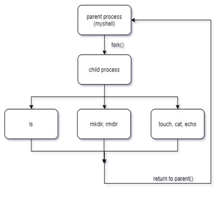
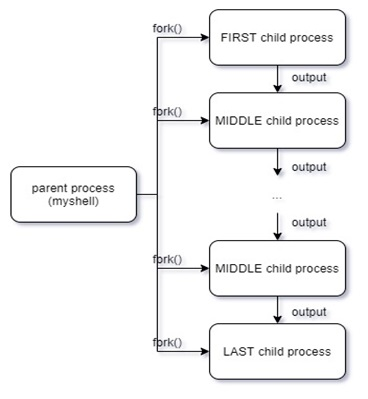

# 1. 개발 목표

linux의 shell과 동일하게 동작하는 customized 된 myshell을 구현한다. myshell 개발을 통해 시스템 레벨에서의 process control, process signalling, interprocess communication 그리고 background job에 대해 이해한다.


# 2. 개발 범위 및 내용

## A. 개발 범위

- Phase1 (fork & signal) 
  - Building and Testing shell
  - linux shell 처럼 cd, ls, mkdir 같은 기본적인 간단한 기능들을 수행할 수 있도록 shell을 build한다.
- Phase2 
  - Redirection and Piping in shell
  - 하나의 child process의 output이 또 다른 child process의 input으로 작동할 수 있게 프로그래밍한다. 
- Phase3
  - Run Process in Background in shell
  - process들이 background와 foreground에서 모두 작동하도록 만든다. 
  - fg, bg 명령을 통해 작업의 상태를 바꿀 수 있다.
  - ctrl c 혹은 ctrl z 키를 입력하여, process에 terminate 혹은 stop action을 요구할 수 있다.


## B. 개발 내용

- Phase 1 (fork & signal)

  - fork를 통해서 child process를 생성하는 방법 

    fork()는 child process를 만들게 되며, child process는 자신만의 pid를 가지게 된다. linux에서 fork는 copy and write를 이용하여 수행되고, child process는 파일 지시자, signal 등을 상속받는다. fork()가 성공할 경우 자식의 pid가 부모에게 return되며, child process에게는 0이 리턴된다. (실패시 -1이 리턴) 부모와 자식의 fork()의 리턴 값이 달라서, 이를 조건문으로 검사하는 방식으로 parent process, child process의 작업을 각각 제어할 수 있다. 

  - connection을 종료할 때 parent process에게 보내는 signal을 handling하는 방법과 flow

    child process가 종료될 때, parent process에게 signal을 보내고, 부모 process가 이를 받으면 종료된 status를 조사할 수 있다. 부모 프로세스에서 wait 혹은 waitpid 함수를 이용하여, 인자로 &status를 주면, 자식 process의 종료 상황이 status에 기록된다. 이 status를 조사하면 종료가 발생한 원인(signal이 발생하게된 종료의 요소 등)을 알 수 있다.


- Phase 2 (Pipelining)
  - Pilpeline('|')을 구현한 부분에 대한 설명 (design & implementation)
    - 부모 프로세스에서 2개의 파일 디스크립터를 저장하기 위한 배열(fd[2])을 선언한다. 이를 pipe()의 인자에 넣어(pipe(fd))주면, 2개의 file descriptors를 생성하게 되고, fd[0]를 input(read)으로, fd[1]을 output(write)로 사용할 수 있게 된다.
    - 자식 프로세스에서 dup2() 함수를 호출(dup2(fd[0], STDIN_FILENO))하여 자신의 stdin을 fd[0]에 연결시킨다. 이 작업을 통해 자식 process의 stdin은 키보드가 아닌 fd[0]에서 데이터를 입력받게 된다.
    - 부모 프로세스에서 dup2() 함수를 호출(dup2(fd[1], STDOUT_FILENO)) 자신의 stdout을 fd[1]에 연결시킨다. 이 작업을 통해 부모 프로세스의 stdout은 터미널 디스플레이가 아닌 fd[1]으로 write하게 된다.
    - 부모 프로세스로부터 파이프 입력 end를 통해 자식 프로세스로 데이터가 전달되면, command를 수행(execvp())하고 그 결과를 stdout을 통해 출력한다.
  - Pipeline 개수에 따라 어떻게 handling 했는지에 대한 설명
    - 
    - pipe structure를 위 그림과 같이 떠올린다면, pipe command의 유형을 크게 3가지로 나눌 수 있다. (머리 - 몸통 - 꼬리)
      - 머리 pipe command는 fd[1]만 활용한다
      - 몸통 pipe command는 fd[0]과 fd[1]을 모두 활용한다.
      - 꼬리 pipe command는 fd[0]을 모두 활용한다.
    - pipe의 개수가 1개여서 pipe command의 개수가 2개라면, 머리 pipe command와 꼬리 pipe command 연결한다.
    - pipe의 개수가 n개(>=2)여서 pipe command의 개수가 n+1개라면, 머리 pipe command 1개와 몸통 pipe command (n-1)개 꼬리 pipe command를 연결한다.


- Phase 3 (background process)
  - Background ('&') process를 구현한 부분에 대해서 간략히 설명
    - foreground process는 자식 process를 fork한 뒤, 곧바로 wait()을 불러, 자식 process의 수행이 종료되기를 기다린다.
    - 그러나, background의 process는 자식 porcess를 fork한 뒤 wait()을 하지 않는다. 이러한 처리로 자식 프로세스가 부모 프로세스와 별개로 (background로) 수행이 되도록 하는 것이다.
    - 시간이 지나 자식 process가 수행을 마치고 종료되면, 부모 process에게 signal을 보내게 되는데, 이 signal을 sigchld handler가 catch하고 자식 process를 reap해준다.
    - background로 수행 중인 process에 대해 Kill(pid, SIGKILL) 명령을 주어서 pid에 해당하는 자식 process를 종료시킬 수 있다.


##  C. 개발 방법

### - phase 1

- execvp()

  execve() 의 인자로 바이너리 실행파일로 된 filename을 주면, 해당 파일에 저장된 내용을 실행할 수 있다. shell의 기본 동작을 구현하기 위해서는 /bin/에 저장된 실행파일에 접근하면 된다. execvp() 함수는 PATH에 등록된 디렉토리에 있는 프로그램을 실행하는 함수이고, 이 프로젝트에서는 PATH에 저장된 /bin/ 에 저장된 실행 파일 이외에 다른 file로의 접근이 필요하지 않으므로, execve() 대신 execvp() 함수를 사용하였다.

- cd

   그런데 /bin/에는 cd(change directory)에 해당하는 실행파일이 들어있지 않아, 이 부분을 <direct.h>에 있는 chdir() 함수를 사용하여 직접 구현한다.

  ```c
  void change_dir(int argc, char **argv) {
      if ((argc != 2) || chdir(argv[1]) == -1) {
          printf("cd argument err!\n");
      }
  }
  ```


### - phase 2

- void tokenize_for_pipe_command(char *cmd, char** argv)

  '|' 로 구분되어 입력되는 pipeline command는 '|'를 기준으로 분리하며 하나의 명령어씩 수행해야하므로, pipeline command의 경우 이를 parsing하는 새로운 함수를 정의 하였다.


- int pipe_command(char*cmd, char **argv, int input, PCMD_TYPE pipe_type, pid_t *pid)

  B에서 설명한 pipe command structure대로 명령 체계를 구축하려면, 단일 명령과는 다른 작업이 필요하여 새로운 함수를 정의하였다. fork()를 통해 자식 프로세스를 생성하고, 해당 process의 stdin과 stdout을 조작하여, 모든 process들이 연결될 수 있도록 작업하였다.


### - phase 3

- JOB 구조체

  ```c
  typedef struct JOB_info{
      int ind;
      pid_t pid;
      JOB_STATE state;
      char cmdline[MAXLINE];
  }JOB_info;
  ```

  명령이 들어올 때마다 이에 대한 정보를 프로그램 내에서 hold하고 있어야, 해당 pid에 대한 업데이트 및 삭제가 가능하다. state는 foreground, background, stopped, undefined 4가지이다.

  

- JOB_info JOBS[MAXJOBS];

   JOB 정보를 가지는 구조체 배열이다.

- JOB 관련 함수들

  - void list_jobs()

    JOBS 배열에서 hold하고 있는 fg 혹은 bg 상태의 job들을 출력하여 보여준다. 

  - int push_job(pid_t pid, int state, char *cmdline)

    pid에 해당하는 command 정보를 JOBS 배열에 저장한다.

  - int delete_job(pid_t pid)

    pid에 해당하는 command 정보를 JOBS 배열에서 제거한다

  - int update_job(pid_t pid, int state)

    pid에 해당하는 command의 상태(state)가 변화한 경우, 해당 job object를 찾아 이를 업데이트한다.

  - JOB_info *get_JOB_info_or_NULL(pid_t pid)

    waitpid() 같은 함수들이 process의 pid를 인자로 주어 signal을 handling하므로, pid를 이용하여 job object를 가져오는 함수가 필요하며 이를 수행하는 함수이다.

  - void waitfg(pid_t pid)

    foreground로 돌고 있는 process에 대한 reap 작업을 수행한다. 

    - WIFSTOPPED(status) 함수를 이용하여 반환의 원인이 된 자식프로세스가 현재 "정지"되어 있는지를 점검한다. 해당 process가 stop 시그널을 받았다면, JOBS 구조체 배열에서 state를 ST로 update한다.
    - WIFSIGNALED(status) 함수를 이용하여 자식 process가 terminate 되었는지를 점검한다. terminate 되었다면, 정상적으로 종료되었다는 메세지를 준다. JOBS 구조체 배열에서 해당 job object를 삭제한다.


- int parseline(char *buf, int *argc, char **argv)

  background 명령을 인지하고, argv에는 &가 제거된 상태로 저장하기 위해 이에 대한 작업을 추가하였다.


- int builtin_command(int argc, char **argv)

  builtin command가 jobs, bg, fg, kill 명령을 수행하도록 작업하였다.

  - jobs : list_jobs() 함수를 call
  - bg : stop 시그널에 의해 정지된 process를 background로 재실행한다.  Kill(pid, SIGCONT) 명령 수행후 update_job() 함수를 call
  - fg :  stop 시그널에 의해 정지된 process를 foreground로 재실행한다. Kill(pid, SIGCONT) 명령 수행후 update_job() 함수를 call
  - kill : pid에 해당하는 자식 process의 수행을 멈춘다. Kill(pid, SIGKILL) 명령 수행후 update_job() 함수를 call


# 3. 구현 결과

## A. Flow Chart

### - Phase 1 (fork)



### - Phase 2 (pipeline)



### - Phase 3 (background)

