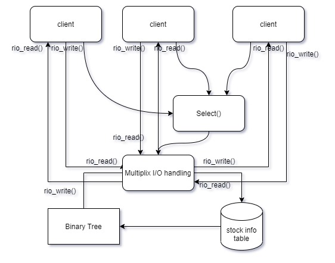
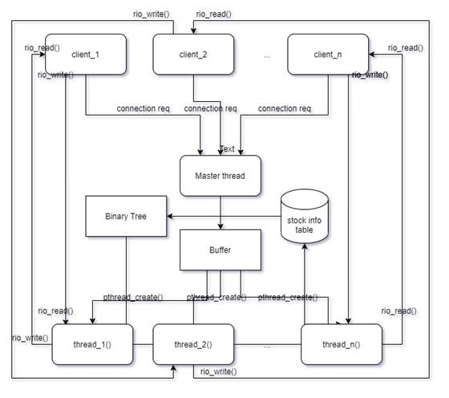
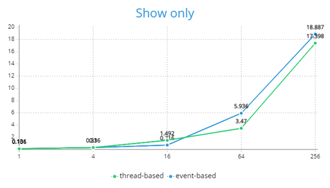
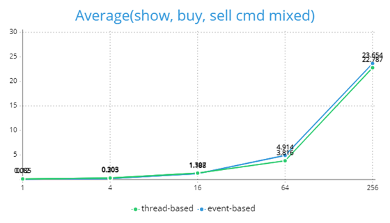

    HOW TO EXECUTE
    1. Enter the 'make' command to compile.
       Then, the 'myshell.out' executable file is created.
    2. Enter the './myshell.out' command to run the 'myshell.out' file.
    3. If you want to delete the object file and the executable file,
       run the 'make clean' command.

# 1. 개발 목표

주식 서버 프로그램을 구현한다. 단일 프로세스 혹은 thread 기반 stockserver는 여러 client와 connection이 불가능하다. 해당 프로젝트에서는 concurrent network programming을 이용하여 주식 서버를 구축한다. concurrent programming을 구현하기 위해서는 2가지 방식이 있는데, `select()`를 이용한 Event-based Approach가 있고, pthread를 이용한 Thread-based Approach가 있다. 각각의 방식으로 주식 서버를 구축해보고, 각 프로그램의 수행 결과를 비교, 대조하면서 성능을 분석해본다. 

 

# 2. 개발 범위 및 내용

## A. 개발 범위

### 1. select

select는 C언어의 `scanf()`와 같은 blocking 함수로써 파일들을 감시하고 있다가, file descriptor에 event가 발생하게 되면, block 상태가 해제된다. select가 감시하고 있는 파일 중 변화가 생긴 갯수를 반환하며, 만약 실패시 -1을 반환한다.

### 2. pthread

`pthread_create()`로 thread를 생성하여, 각 client와의 connection을 담당한다. 이로써, 여러개의 connectio nrequest가 직렬화되어 순서대로 처리되는 것이 아닌, concurrent한 대응이 가능해진다.

 

 

## B. 개발 내용

### 1. select

- select 함수로 구현한 부분에 대해서 간략히 설명

  ```c
  pool.nready = Select(pool.maxfd+1, &pool.ready_set, NULL, NULL, NULL);
  ```

  - 먼저, `init_pool()` 함수를 통해서, file descriptor들을 0으로 초기화(`FD_ZERO()`함수 사용)하고, `listenfd`를 파일 디스크립터로 설정한다. 이 파일 디스크립터를 Select의 인자로 넘겨줌으로써, server는 client로부터의 connection request를 들을(listen할) 준비를 하게 된다. 


- stock info에 대한 file contents를 memory로 올린 방법 설명

  - `connfd`를 하나 close 할 때마다, client와 남아있는 connection이 있는지 점검하여, 모든 client와 connection이 끊어졌을 때, 프로그램 내에서 이진트리 자료구조로 저장(비휘발성 메모리 DRAM이라고 가정)하고 있는 주식 정보를 주식 관리 테이블에 적재한다. 주식 정보는 pool 구조체의 `clientfd[]`가 가지고 있다. 

  ```c
   typedef struct { 
  
      ...     
  
      int clientfd[FD_SETSIZE];  
  
      ...
  
  }pool;
  
  ```

  `FD_SETSIZE` 만큼 순회하면서, 모든 connection이 닫혔는지(값 == -1)를 점검한다. 모든 connection이 닫혀있다면, 이를 주식 관리 테이블 메모리에 적재한다.


### 2. pthread

- pthread로 구현한 부분에 대해서 간략히 설명
  - `pthread_create()`는 thread를 생성한다. 해당 함수는 ''실행할 함수''와 ''그 함수에 넣어줄 인자''를 인자로 받아서, 특정 함수를 실행시킨다. 이 프로젝트에서는 client의 query에 대한 response를 수행하는 함수를 인자로 넣어, 이를 실행한다.
  - `pthread_self()`는 현재 실행 중인 thread의 id를 리턴한다. 
  - `Pthread_detach()`의 인자로 `pthread_self()`(현재 실행 중인 thread의 id)를 주게 되면, `pthread_join()` 없이도, 쓰레드 종료시 resource를 해제한다.

​               

 

## C. 개발 방법

### 1. task1 (event-based)

```c
typedef struct {
    int maxfd;         
    fd_set read_set;   
    fd_set
	ready_set;    
    int nready;         
    int maxi;           
    int clientfd[FD_SETSIZE];  
    rio_t clientrio[FD_SETSIZE];
}pool;

```


- pool 구조체는 connected descriptor들의 pool을 나타내는 구조체이다.
  - `int maxfd` - read_set number가 가장 큰 descriptor이다.
  - `fd_set read_set` - active한 descriptor들의 set이다.
  - `fd_set ready_set` - reading을 기다리는 descriptor들의 set이다.
  - `int nready` - ready descriptor들의 개수를 나타내는 변수이다.
  - `int maxi` - maxi는 클라이언트 배열의 최대 인덱스 값을 나타낸다.
  - `int clientfd[]` - activedescriptor들의 set이다. 이 배열을 순회하면서, client와의 모든 connection이 종료되었는지를 점검할 수 있다.
  - `rio_t clientrio[]` - 모든 active한 read buffer들을 담고 있다.
- `init_pool()` : 처음에는 connected descriptor가 없으므로, `clientfd[i]`를 -1로 초기화한다. `FD_SET(listenfd, &p->read_set)`을 통해 client로부터의 connection request를 들을 준비를 한다.
- 위 구조체에서 생성한 정보들을 `Select()` 함수의 인자로 넣어주게 되면, event를 기다리는 상태가 되는 것이다.
- `add_client()` : pool 구조체에 connected descriptor를 담게 된다.
  ​
- `response()`
  - client로부터의 query를 처리하는 핵심적인 함수이다. client로 부터 show, buy, sell, exit의 명령이 올 수 있는데, 이 메세지를 `Rio_readlineb(&rio, buf, MAXLINE)` 함수로 받아 적절한 response 메세지를 보내준다.
  - `show_nodes()`는 현재 이진 트리 자료구조에 저장된 주식 정보를 client에게 보여주는 함수이다.
  - `buy()`는 client가 buy 주문을 하였을 때, server에서 가지고 있는 주식 정보를 업데이트하고, 매수에 성공하였다는 메세지를 client에게 보내는 함수이다. 이때, client가 요구한 매수량보다 잔여 주식이 적은 경우, 잔여주식이 없다는 메세지를 보내게 되며, client의 요청은 수행되지 않는다.
  - `sell()`는 client가 sell 주문을 하였을 때, server에서 가지고 있는 주식 정보를 업데이트하고, 매도에 성공하였다는 메세지를 client에게 보내는 함수이다. `buy()`와는 다르게 잔여주식에 대한 고려를 하지 않아도 된다.
  - `exit()`는 client와의 connection을 끊도록 만들며, server쪽에서는 exit 요청을 잘 받았다는 메세지를 client에게 전해준다.


### 2. task2 (thread-based)

```c
typedef struct {
    int buf;           /* Buffer array */
    int n;             /* Maximum number of slots */
    int front;         /* buf[(front+1)%n] is first item */
    int rear;          /* buf[rear%n] is last item */
    sem_t mutex;       /* Protects accesses to buf */
    sem_t slots;       /* Counts available slots */
    sem_t items;       /* Counts available items */
} sbuf_t;
```


- task2에서는 `connfd`를 관리하기 위한 구조체로 `sbuf_t`를 선언한다.
  - `int *buf` - buffer 배열이다.
  - `int n` - 해당 구조체가 hold할 수 있는 maximum slot 개수를 나타낸다.
  - `int front` - buf array가 circular하게 관리되고 head 부분을 상징하는 int 값이다.
  - `int rear` - 마찬가지로 buf array가 circular하게 관리되고 tail 부분을 상징하는 int 값이다.
  - `sem_t mutex` - Producer - Consumer 문제를 해결하기 위한 semaphore 변수이다. (이는 아래에서 자세히 서술)
  - `sem_t slots` - 해당 자료구조의 빈 자리의 개수를 상징한다
  - `sem_t items` - 해당 자료구조가 현재 담고 있는 item의 수를 나타낸다.
- task2의 response함수도 task1과 동일한 동작을 한다. task1과 다른 점은 thread를 생성함과 동시에 해당 thread가 response 함수를 수행할 수 있도록 하는 것이다.
- task2에서 read 혹은 write를 구현할 때, read thread가 write thread를 (혹은 그 반대의 경우도) 방해하지 못하게끔 조치하는 것이 중요하다. 이는 아래서 자세히 설명한다.

# 3. 구현 결과

## A. Flow Chart

### 1.task1(event-based)



 

### 2. task2



 

 

 

## B. 제작 내용

- 공통적인 issue로 client와 server가 `Rio_readlineb()`, `Rio_writen()`으로 소통하는 데에 있어, 개행 문자 처리에 어려움을 겪었다. 
- client가 show 명령을 입력하면, server 쪽에서 이를 인지하게 된다.
- 관련 내용을 buf에 담아 `Rio_writen()`으로 보내게 되면, 개행 문자 및 NULL 문자가 문제가 될 때가 많았다.
- server 쪽에서는 모든 메세지를 다 보내어 더이상 전송할 것이 없는데, client 쪽에서 `Rio_readlineb()`로 기다리는 상황이 반복되었다. 
- server쪽에서 전송하는 메세지 끝의 개행문자 혹은 NULL문자 만으로는 client가 '모든' 메세지가 전송되었다고 인지하도록 하는 것이 어려웠다.
- 이 프로젝트에서 client의 show 명령으로 서버에서 보내 주는 메세지는 오롯이 숫자인 점을 이용하여, server에서 보내는 메세지의 끝에 character E를 붙여(end를 의미)보내었고, 이를 client가 메세지의 끝으로 인지하게끔 하였다.


### 1. select

- `Select()`의 첫번째 인자로 들어가는 값으로, 검사할 파일 디스크립터의 범위 지정해야하며, 검사해야할 파일 디스크립터의 개수를 전달하면 되었다. 

- 이 때, 파일 디스크립터 값이 0부터 시작하므로, 가장 큰 파일 디스크립터 값(`pool.maxfd`)을 인자로 주는 것이 아니라, 1을 더한 `pool.maxfd + 1`을 인자로 넘겨야 했다.

-  프로젝트의 요구사항으로 client와의 모든 connection이 제거되었을 때, 프로그램 내의 stock info의 내용을 주식 관리 테이블 메모리에 적재해야 했다. 

  - client와 모든 connection이 제거되었음을 어떻게 알 수 있는지가 중요한 이슈였는데, connfd가 close가 될때마다, 아래와 같이 pool의 `clientfd[]`가 모두 -1로 값이 변경되었는지를 check 하였다. 

    ```c
    int connection_flag = 0;
    
    for (int i = 0; i < FD_SETSIZE; i++) {
        if (p->clientfd[i] != -1){
    		connection_flag = 1;
            break;
        }
    }
    ```

    


### 2. pthread

- NTHREADS개 만큼 thread를 미리 띄우는 thread pooling을 하여, 요청이 올 때마다 thread를 띄우는 오버헤드를 방어하였다.

- pthread로 concurrent programming을 할 때, Producer-Consumer 이슈가 발생할 수 있다. 

  - `sbuf_insert()`, `sbuf_remove()`를 구현하여, buf에 새로운 원소를 produce하거나 혹은 consume할 때, semaphore로 감싸서 다른 thread의 간섭을 받지 않도록 조치하였다.

- 마찬가지로, task2에서도 client와 모든 connection이 제거되었음을 어떻게 알 수 있는지가 중요한 이슈였다. 

  - 이 때, `CNT`라는 변수를 두어, connection이 이루어진 client의 개수를 전역 변수로 세었다. 
  - 새로운 client가 들어올 때, `CNT++`를 해주고 `Close()`로 connection이 해제될 때, `CNT--`를 해주었다. 
  - 이 때, 한 thread에서 해당 코드 line을 수행중일 때, 다른 thread가 방해하면, 의도하지 않은 결과가 발생할 수있다. 
  - 이를 막고자 semaphore 를 활용하여, 해당 코드라인이 실행될 때 다른 thread의 방해를 받지 않도록 하였다. 

  ```c
  P(&t);
  CNT++;
  V(&t);
  ```

  - `CNT == 0`일 때, 모든 connection이 제거된 것으로 판단한다.


## C. 시험 및 평가 내용

## 0. 사전 예측

- event-based 모델 기반 concurrent programming의 runtime에 영향을 미치는 요소들에 대한 생각
  - 내부에 computationally intensive for loop가 있어 느려질 수 있다.
  - event loop가 현재 요청을 모두 처리하기 전까지는 다음 요청을 받아들이지 않는다.
  - 새로운 file descriptor를 만드는데 (thread를 만드는 것보다 상대적으로) 오버헤드가 적다.
- thread-based 모델 기반 concurrentprogramming의 runtime에 영향을 미치는 요소들에 대한 생각
  - thread를 생성하는 데에 시간이 많이 걸린다.
  - 각 thread가 독립적으로 실행되기 때문에 시간이 적게 걸릴 수 있다.
  - thread간의 간섭을 막기 위해 semaphore를 활용하는데, 이에 대한 오버헤드가 있다.

각 모델에서 예측이 되는 runtime에 영향을 미치는 긍정적인 요인과 부정적인 요인들이 있었다. 이들 중 어떤 요소의 영향력이 우수한지 예측해보았을 때, "기본적으로 여러개의 thread를 띄워 독립적으로 수행하는 thread 기반 모델이 속도가 더 좋지만, show 명령같이 reader thread 만을 호출하는 경우에는 writer thread의 방해를 막기 위해 활용하는 semaphore 때문에, 그에 대한 오버헤드로 속도를 지연시킬 것"으로 예상하였다.

 

아래는 C의 `clock()` 함수를 활용하여, multiclient의 수행 시간을 기록하였다.

```c
printf("수행 시간 : %f\n", (float)(end - start)/CLOCKS_PER_SEC);
```

 x축은 client process의 개수이며, 4배씩 늘려가면서 측정하였다. y축은 multiclient 프로그램의 수행시간이다. 단위는 ms이다.

 

## 1. 'Buy' or'Sell' only


 

 

## 2. 'Show' only



 

 

## 3. Average('Buy','Sell', 'Show' mixed)



 

 

- 3의 수행은 read와 write가 고르게 섞여있는 수행이다. 
- 이 3의 결과로 미루어볼때, thread-based는 프로그램의 수행이 thread별로 독립적으로 수행된다는 요인이, thread-based의 속도를 저해하는 요인 혹은 event-based의 긍정적인 요인보다 더 우세하다고 생각할 수 있었다.
- 1처럼 buy 혹은 sell 명령만 수행하는 경우, thread-based의 수행이 event-based의 수행보다 빨랐다. 
- thread-based는 기본적으로 event-based보다 수행이 빠른데(3을 미루어봤을때), 1과 같이 write 위주의 수행만을 진행하는 경우, semaphore의 사용이 상대적으로 적어지게 된다. 그러한 요인에서 얻어지는 속도의 이익이 그래프에 소폭 반영된 것으로 해석된다.
- 2처럼 read 위주로 프로그램을 수행하는 경우, thread-based에서는 semaphore를 좀 더 많이 사용하게 된다. 1과 비교하였을 때 상대적으로, 이 semaphore에 대한 오버헤드 때문에 thread-based와 event-based의 수행 속도의 갭이 소폭 줄어든 것으로 생각해볼 수 있다. 
- 1과 2를 비교해보면, thread-based와 event-based 둘 다 read의 작업이 좀 더 시간을 많이 소요됨을 관찰할 수 있다. 이 프로젝트의 경우 write은 해당 node만 탐색하여, 값을 수정하는 데 반해, read는 모든 node를 방문하면서 이에 대한 내용을 client에 전달하므로, 좀 더 수행시간이 있는 것으로 생각할 수 있다.
- 1, 2, 3의 그래프를 살펴보면, client process의 개수가 증가할 수록 둘의 수행시간 차이가 더 많이 나는 것을 관찰할 수 있다. 심지어 2를 보면 항상 thread-based가 빠른 것도 아닌데, 이는 client process의 개수가 적은 경우, event-driven approach와 thread-based approach가 유의미한 차이를 나타내지 않음을 생각할 수 있다.